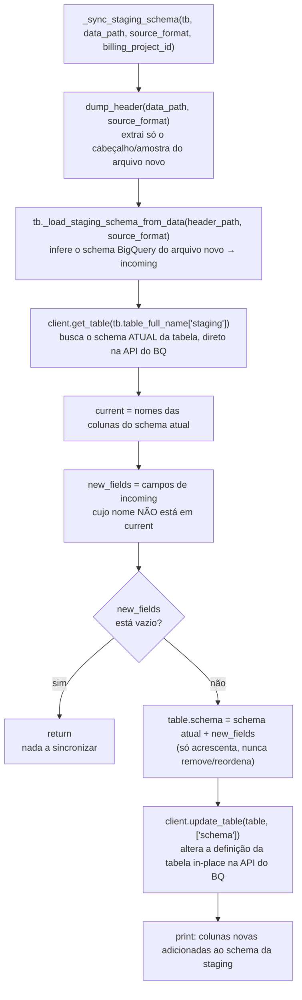
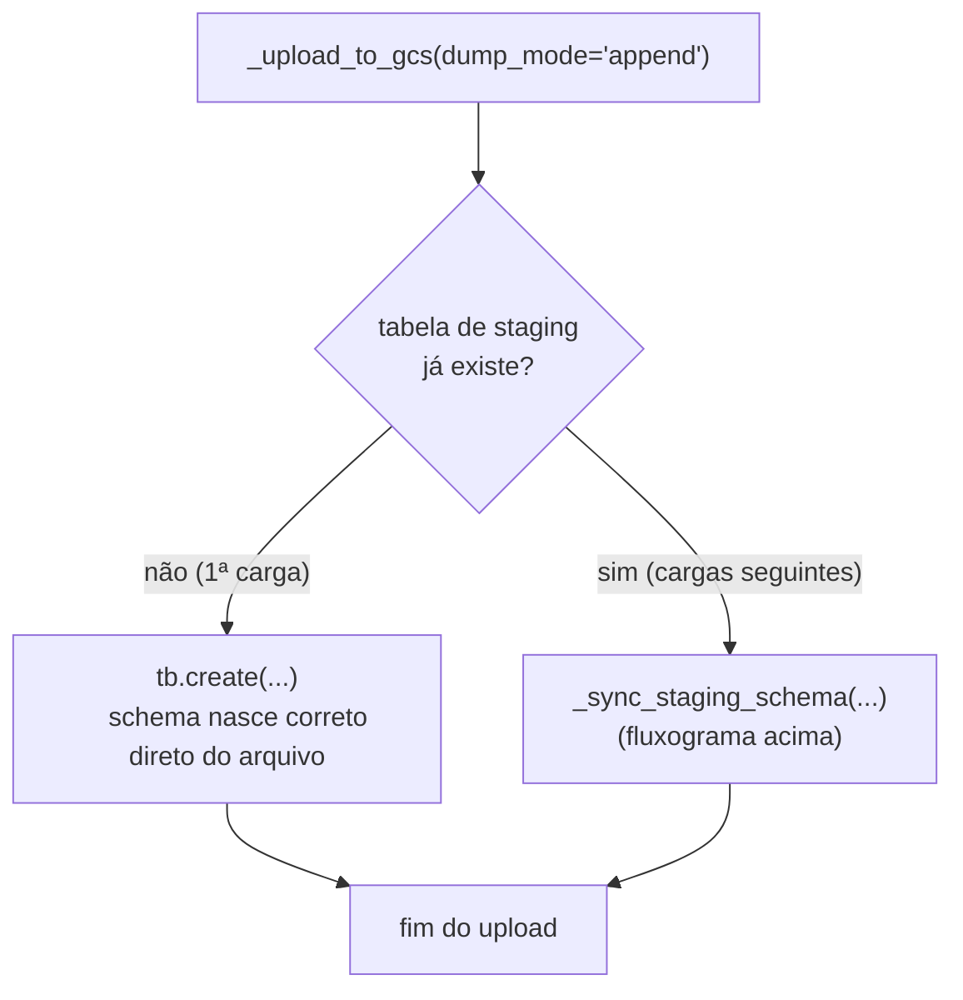

# `_sync_staging_schema` — o que faz, fluxograma e análise de risco

**Contexto:** investigado durante o review do PR [basedosdados/pipelines#1819](https://github.com/basedosdados/pipelines/pull/1819) (`fix(br_sfb_sicar): destrava a materialização — dbt_alias, sincronização da staging e teste de unicidade`), que altera essa função em `pipelines/utils/tasks.py`.

## O que é e quando roda

`_sync_staging_schema` vive em `pipelines/utils/tasks.py:57-107`, e resolve um problema específico de tabela externa no BigQuery: **o schema da tabela de staging fica congelado no momento em que ela é criada**. Quando a fonte passa a publicar uma coluna nova, o arquivo novo a traz, mas a definição da tabela externa não — e o `dbt run` quebra com `Unrecognized name` na primeira materialização que tentar ler algo relacionado a essa coluna.

Só roda dentro de `_upload_to_gcs`, no modo `dump_mode="append"`, e só quando a tabela de staging **já existe** (`tb.table_exists(mode="staging")` é `True`). Na primeira carga a tabela nasce com o schema certo direto do header do arquivo, então não há nada a sincronizar.

## Mecanismo, passo a passo

1. `dump_header(data_path, source_format)` — extrai só o cabeçalho/uma amostra do arquivo novo, sem ler o arquivo inteiro.
2. `tb._load_staging_schema_from_data(header_path, source_format)` — usa a lib `basedosdados` pra inferir o schema BigQuery (nomes e tipos) a partir dessa amostra → `incoming`.
3. `client.get_table(tb.table_full_name["staging"])` — busca o schema **atual**, direto na API do BigQuery (não confia em cache local).
4. `new_fields` = campos de `incoming` cujo nome não está em `current` (schema já declarado).
5. Se `new_fields` está vazio, `return` — nada a fazer.
6. Caso contrário: `table.schema = list(table.schema) + new_fields` (só acrescenta, nunca remove/reordena) e `client.update_table(table, ["schema"])` — altera a definição da tabela **in-place**, sem tocar nos arquivos já carregados no GCS.
7. `print(...)` — único sinal de que uma coluna nova foi adicionada; vai pro log do flow run.

**Duas decisões de design explícitas no docstring da função:**
- **Aditiva por decisão** — nunca remove nem reordena colunas, porque um arquivo parcial (ex.: um período específico) não pode encolher o schema de uma tabela que acumula histórico.
- **Não recria a tabela** — porque a tabela de staging em modo `append` é construída a partir de vários arquivos acumulados no GCS ao longo do tempo; recriar (ou `Storage.delete_table`) apagaria esse histórico. A alteração é feita in-place via API.
- Arquivos antigos, sem a coluna nova, passam a devolver `NULL` pra ela — comportamento padrão do BigQuery pra tabela externa com campo ausente no arquivo.

## Fluxograma



**Onde entra no fluxo maior** (`_upload_to_gcs`, `dump_mode="append"`):



## Como isso era feito no Prefect 0 — não era

No `_upload_to_gcs` genuíno de Prefect 0 (commit `dd7b9d11`), o ramo "`dump_mode=append` e a tabela já existe" fazia só um log:

```python
if tb.table_exists(mode="staging"):
    log(f"MODE APPEND: Table ALREADY EXISTS:\n{table_staging}\n{storage_path_link}")
```

Nenhuma verificação de schema, nenhum `ALTER TABLE`. Uma coluna nova da fonte ficava congelada de fora do schema **indefinidamente** em modo `append`, até alguém rodar com `dump_mode="overwrite"` (que recria a tabela do zero a cada execução).

`_sync_staging_schema` é uma capacidade nova, que só passou a existir na era Prefect 3 — primeira aparição no histórico é o commit `beba2076` (`fix(br_bcb_sicor): destrava flows`), bem depois da migração. Não é restauração de nada; é uma funcionalidade que o Prefect 0 nunca teve.

## O que o PR #1819 muda

Antes do #1819, `_sync_staging_schema` sincronizava **toda** coluna nova detectada, mesmo que nenhum modelo dbt a lesse. Foi assim que `dat_criaca`/`dat_atuali` (publicadas pelo SICAR entre dez/2024 e mai/2025) ficaram divergentes por meses sem quebrar nada — o modelo nunca as lia, mas elas também nunca deveriam ter sido sincronizadas pra começo de conversa.

O PR adiciona:
- `_model_sql(dataset_id, table_id, dbt_alias)` — lê o `.sql` do modelo, resolvendo o arquivo pela **mesma regra e o mesmo `dbt_alias`** que `run_dbt` usa (os dois precisam apontar pro mesmo modelo, senão a sincronização decidiria com base num arquivo que não vai nem rodar).
- `_referenced_in_model(column, model_sql)` — checa se o nome da coluna aparece no SQL (case-insensitive, casando palavra inteira).
- Em `_sync_staging_schema`, `new_fields` passa por esse filtro: só entra no `ALTER`/`update_table` a coluna que o modelo referencia. As demais são logadas como ignoradas. Sem arquivo de modelo (dataset fora da convenção), o comportamento antigo é preservado — sincroniza tudo, sem quebrar quem já dependia disso.

`dbt_alias` é roteado desde `upload_to_gcs` → `_upload_to_gcs` → `_sync_staging_schema`, com default `True` (preserva chamadas existentes que não passam o parâmetro).

## Análise de risco — vantagem real vs. risco que continua existindo

**A vantagem não é evitar um erro silencioso — é evitar um passo manual.** Sem `_sync_staging_schema`, adicionar uma coluna nova ao modelo dbt quebra com `Unrecognized name` (erro alto e claro) até alguém alterar o schema manualmente. Com ela, isso acontece sozinho na próxima run — o desenvolvedor só mexe no `.sql` do modelo.

**Onde o risco de erro silencioso é real, e o #1819 não resolve:**

1. **Inferência de tipo sem validação.** `_load_staging_schema_from_data` infere o tipo BigQuery a partir de **uma amostra** (o header do arquivo atual). Se a amostra não representa bem os dados reais (ex.: parece só inteiro nesse arquivo, mas vem com nulo ou decimal depois), o tipo errado fica gravado **permanentemente** no schema, sem nenhuma validação — só um `print()`.
2. **Só cresce, ninguém revisa.** A operação é aditiva por design; não há alerta nem revisão quando uma coluna nova é adicionada — o único sinal é um `print()` no log do flow run, fácil de passar despercebido. O próprio caso `dat_criaca`/`dat_atuali` prova isso: ficaram lá por meses sem ninguém notar.
3. **O #1819 só reduz a frequência, não o risco por ocorrência.** A filtragem por modelo diminui *quantas* colunas passam por esse caminho, mas quando uma passa, a inferência de tipo continua sem validação e o único sinal continua sendo um `print`.

**Sugestão de comentário de review (não bloqueante):** a filtragem por modelo é uma boa redução de escopo, mas vale considerar logar o **tipo inferido** junto com o nome da coluna (não só o nome), ou até tratar como aviso mais visível — não silencioso — quando uma coluna nova é adicionada ao schema.
