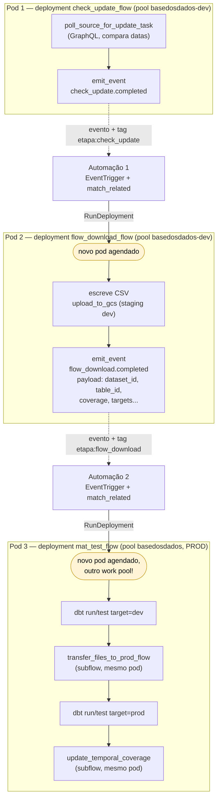
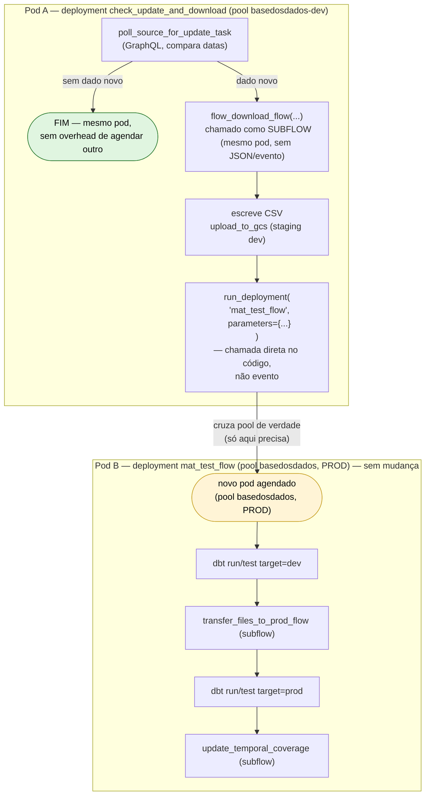

# Automação (evento) vs. subflow/`run_deployment()` direto

Discussão que surgiu depois de terminar o piloto: dado como a cadeia real
ficou (e os problemas que apareceram no caminho — ver
`staging-multi-ambiente.md`), será que o mesmo resultado sairia mais simples
sem automação nenhuma? Este documento registra a comparação, não é uma
decisão — o piloto atual (issue #1867) continua implementado com
automações.

## O que temos hoje

3 deployments separados, ligados por 2 Automações reagindo a evento
(`emit_event` → `EventTrigger` → `RunDeployment`):

**Custo medido de verdade, nesta sessão**: cada seta pontilhada (evento →
automação → `RunDeployment`) implica agendar um **pod novo do zero** —
`Worker submitting` → `Creating Kubernetes job` → `Opening process` →
`git_clone` — e isso levou **70–90+ segundos só de overhead**, antes de
qualquer trabalho de verdade começar, em praticamente todo teste que
fizemos. Cada hop também exige que o dado atravesse a fronteira do pod via
JSON (`encode_params`/`decode_params`), nunca em memória.

## O que foi proposto (discussão, não implementado)

A pergunta que motivou isso: **subflow não abre pod novo** — roda no
mesmo processo de quem chama (confirmado nos nossos próprios logs: quando
`mat_test_flow` chamou `transfer_files_to_prod_flow`, não teve
`Creating Kubernetes job` nenhum, só "Beginning subflow run" um segundo
depois). Então por que pagar o preço do evento pra saltos que não
precisam disso?

Passamos por duas correções ao longo da conversa antes de chegar na
proposta final:

1. **"Faz tudo um flow só com subflow"** — errado: um subflow roda no
   mesmo pod do pai, então o pod inteiro teria que ser dimensionado pro
   pior caso (ex. se `mat_test` fosse subflow de `check_update`, todo
   `check_update` pagaria o tamanho de pod do `mat_test`, mesmo quando não
   há dado novo — que é o caminho mais comum).
2. **"Então `mat_test` continua separado por causa de recurso"** —
   também errado: `dbt` contra BigQuery é essencialmente rede (BigQuery
   é o serviço que processa; o pod só manda a query e espera). Não precisa
   de pod grande.
3. **Motivo real que sobra pra `mat_test` continuar separado**: **pool**.
   Só ele precisa rodar em `basedosdados` (prod) pra ter a credencial de
   escrita real — confirmado na prática (`dbt-rpc@basedosdados...` só
   apareceu depois de mover o deployment pra esse pool). Subflow não
   cruza pool; só um deployment novo cruza.

Proposta final: **2 deployments, 1 chamada direta (`run_deployment()`),
zero automação**:

No caminho mais comum ("sem dado novo" — a maioria das execuções reais),
a proposta nunca sai do Pod A: zero agendamento de pod extra, zero JSON
de evento, zero tag/`match_related`. Só quando há dado novo é que existe
**uma única** travessia de pod (pra `mat_test`, porque só ali existe
motivo real — o pool).

## Comparação direta

| | Hoje (automação) | Proposta (subflow + `run_deployment()`) |
|---|---|---|
| Deployments | 3 (`check_update`, `flow_download`, `mat_test`) | 2 (`check_update`+`flow_download` juntos, `mat_test`) |
| Pods agendados no caminho "sem dado novo" | 1 (só `check_update` — os outros nunca disparam) | 1 (igual) |
| Pods agendados no caminho "há dado novo" | 3 (um por deployment) | 2 (`check_update`+`flow_download` no mesmo pod; `mat_test` separado) |
| Overhead de agendamento de pod, medido | ~70-90s **por hop** (2 hops = ~2-3min só de espera) | ~70-90s só na travessia pro `mat_test` (1 hop) |
| Passagem de parâmetro entre check_update→flow_download | JSON via evento (`encode_params`/`decode_params`) | Argumento de função Python, em memória |
| Passagem de parâmetro pra mat_test | JSON via evento | JSON via `parameters=` do `run_deployment()` (mesma necessidade — cruza pod de qualquer jeito) |
| Isolamento entre automações (tags, `match_related`) | Necessário — construído nesta sessão | Não existe — não há evento pra isolar |
| Testar localmente | Precisa deploy + disparo real + esperar pod (minutos) | `check_update`+`flow_download` testáveis com uma chamada Python direta, sem pod |
| Gatilho externo pro `mat_test` (fora desta cadeia) | Automação permite qualquer evento externo disparar | `run_deployment()` só dispara de dentro do código que chama — perde essa flexibilidade |
| Bugs reais que isso causou nesta sessão | `InvalidJinja` (deploy desincronizado), staging partido entre pods, `targets`/`partition_folders` só existem pra rotear isso | Nenhum desses existiria pro hop check_update→flow_download |

## Trade-off honesto

A proposta é mais simples e mais rápida pro caminho comum, e evita a
categoria de bug que mais apareceu nesta sessão (coisas que só existem
por causa da fronteira de pod/evento). O que se perde: automação permite
que **qualquer evento externo** dispare uma etapa — não só "a etapa
anterior terminou". Pro `mat_test_flow` genérico (pensando nos ~82
datasets reais), isso pode importar: se um dia quiser que outra coisa
além de `flow_download` dispare materialização (ex. um botão manual, um
outro pipeline), automação escala melhor pra esse cenário. `run_deployment()`
direto só dispara de onde o código chama — quem quiser disparar de outro
lugar precisa saber chamar explicitamente, não só "escutar o mesmo
evento".

## Decisão final (2026-09-01): mantém automações

Depois de pesar os dois pontos da tabela acima, a proposta foi
**descartada** — dois argumentos do usuário derrubaram os dois ganhos que
a proposta alegava:

1. **O overhead de agendar pod não é um problema de verdade.** Os ~70-90s
   medidos por hop importam quando se está testando interativamente
   (esperando na tela, como fizemos a sessão inteira) — mas os datasets
   reais rodam **agendados** (cron diário/semanal), não de forma
   interativa. Alguns minutos de latência de agendamento são irrelevantes
   nesse contexto. O "custo medido" da tabela é real, mas não é uma boa
   razão pra mudar a arquitetura.
2. **A proposta ainda tinha isolamento de memória fraco.** Juntar
   `check_update` (trivial) com `flow_download` num deployment só —
   como a proposta fazia — só move o problema de lugar: `flow_download`
   de datasets reais pode ser pesado de verdade (download + limpeza
   local, `pandas`, etc., bem diferente do piloto sintético), então o
   `check_update` (que roda a cada agendamento, inclusive nos ~50% de
   vezes em que não há dado novo) voltaria a pagar o tamanho de pod do
   `flow_download` sempre que os dois estivessem no mesmo deployment.
   3 deployments separados é o único jeito de dar isolamento de recurso
   completo entre as 3 etapas — vale mais que economizar minutos de
   agendamento.

**Conclusão**: a arquitetura de automações (3 deployments, 2 Automações)
já implementada e validada de ponta a ponta (dev e prod reais, ver
`issue-1867-pipeline-eventos.md`, partes 5–13) é a que segue. Este
documento fica como registro do porquê a alternativa foi considerada e
descartada, pra não reabrir a mesma discussão do zero mais adiante.
