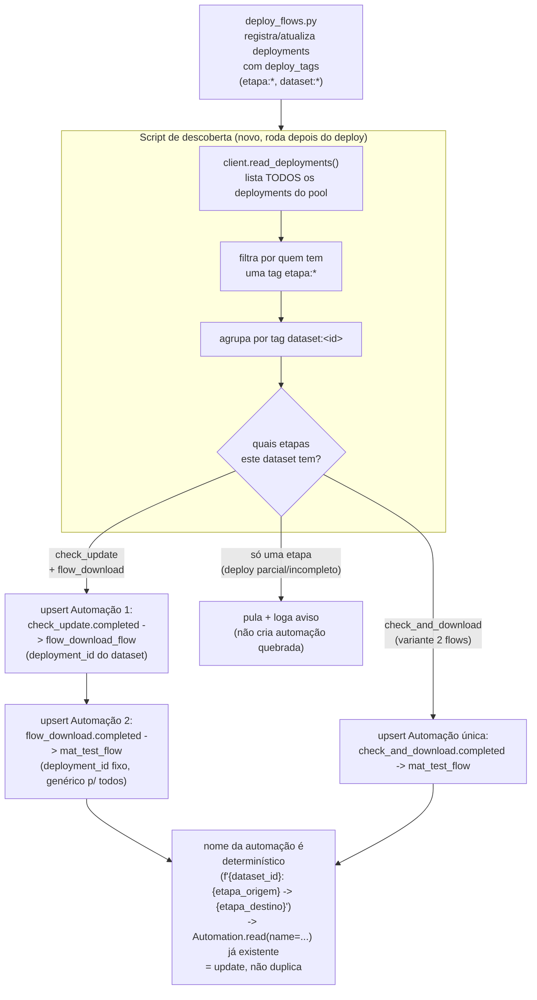

# Automações em massa — descoberta por tag, sem lista hardcoded por dataset

> **Obsoleto.** Decidido usar `run_deployment()` em vez de `Automation`
> (ver [run-deployment-vs-automacao.md](./run-deployment-vs-automacao.md),
> implementado e testado com sucesso em 2026-09-01). Com
> `run_deployment()`, a lógica de disparo já mora no código de cada
> dataset (que já sabe seu `dataset_id`) — o problema que este documento
> resolvia (como criar automações em massa sem script manual) não existe
> mais. Mantido só como registro histórico do raciocínio.

Documento complementar a
[issue-1867-pipeline-eventos.md](./issue-1867-pipeline-eventos.md) (parte 15) —
detalha o design de um mecanismo pra criar/atualizar as automações de
**todos os datasets migrados de uma vez**, sem precisar de um script manual
por dataset.

## O problema

Hoje, criar as automações de um dataset é rodar
`scripts/pilot_event_automations.py` à mão — o script tem uma lista
`AUTOMATIONS` **hardcoded**, escrita pensando só no `test_event_pipeline`.
Pra cada dataset real migrado (dos ~82 da issue), alguém teria que
escrever/editar essa lista e rodar o script de novo. Isso não escala como
processo manual recorrente, principalmente porque não é só migração
única: todo dataset **novo** que adotar esse padrão no futuro precisaria do
mesmo passo manual.

## Por que não dá pra ter uma única automação "genérica de verdade"

Investigado o suficiente pra descartar a ideia mais simples ("uma
automação só, que casa por tag e descobre sozinha o que disparar"):
`RunDeployment` (a ação de uma automação) exige um `deployment_id`
**concreto** (`UUID`), resolvido no momento em que a automação é
criada/atualizada:

```python
class DeploymentAction(Action):
    source: Literal["selected", "inferred"] = "selected"
    deployment_id: Optional[UUID] = None
    # source="selected"  -> deployment_id obrigatório (um UUID fixo)
    # source="inferred"  -> roda a MESMA deployment que emitiu o evento
    #                       (útil pra "se este flow falhar, tenta de novo
    #                       ele mesmo" — não serve pra "roda o irmão dele")
```

Não existe um terceiro modo "ache a deployment certa em runtime por tag".
Ou seja: por baixo, sempre vai existir **um par de automações por
dataset** — o que muda é só se esse par é escrito à mão (não escala) ou
gerado automaticamente por um mecanismo genérico (o resto deste
documento).

## Design proposto: descoberta por tag + upsert em massa



Passo a passo:

1. **Listar** todos os deployments do pool relevante (`client.read_deployments()`
   ou uma chamada filtrada) — não uma lista escrita à mão.
2. **Filtrar** os que carregam alguma tag `etapa:<...>` (convenção já
   existente, `deploy_tags()` em `pipelines/utils/automations.py`).
3. **Agrupar** por tag `dataset:<id>` — dá o conjunto de etapas que cada
   dataset já tem deployado.
4. **Classificar** cada grupo:
   - tem `etapa:check_update` **e** `etapa:flow_download` → padrão de 3
     flows, upsert das duas automações (mesmo mecanismo já provado no
     piloto, `build_chained_automation`).
   - tem só `etapa:check_and_download` → variante de 2 flows (49% dos ~82
     datasets da issue original) — upsert de **uma** automação só,
     direto pro `mat_test_flow` genérico. Ainda não prototipada em
     código (só a variante de 3 flows foi implementada/testada até
     agora).
   - tem só uma das duas do padrão de 3 flows (deploy parcial/incompleto,
     ex. só `check_update` foi deployado ainda) → **pula e loga aviso**,
     não tenta criar uma automação apontando pra um deployment que não
     existe.
5. **Upsert idempotente** — nome da automação sempre derivado
   deterministicamente de `dataset_id` + par de etapas (mesma convenção
   de `Automation.read(name=...)` já usada em
   `scripts/pilot_event_automations.py`), nunca de uma lista mantida à
   mão. Rodar o mecanismo de novo (ex. a cada deploy de prod) sempre
   converge pro mesmo estado, nunca duplica.

**Onde rodaria**: como uma etapa a mais no CI de prod
(`cd-prefect3.yaml`), depois do `deploy_flows.py` — assim os
`deployment_id`s já estão frescos quando a descoberta roda. Dataset novo
= só deployar os flows com as tags certas; a automação dele aparece
sozinha no próximo run do CI, sem editar nenhum script.

## Em aberto / não coberto por este design

- **Decomissionamento não é o mesmo problema.** Se um dataset é migrado
  de volta pro flow monolítico (ou removido), as tags dele somem dos
  deployments, e esse mecanismo simplesmente para de re-afirmar as
  automações dele — mas não as **desativa/deleta** automaticamente. Isso
  é o mesmo gap já registrado na parte 15 do documento principal
  (deployment antiga órfã) — resolver os dois juntos faz sentido, mas são
  problemas distintos (deployment do Prefect vs. automação do Prefect).
- **Variante `check_and_download`** — o design acima cobre ela no papel
  (uma automação só), mas nada foi implementado ou testado pra essa
  variante ainda; todo o trabalho de automação até aqui (piloto,
  `build_chained_automation`) foi só pro padrão de 3 flows.
- **Rate limit / custo de listar todos os deployments a cada deploy** —
  não avaliado; provavelmente irrelevante em ~180 deployments (uma
  chamada de listagem, não uma por deployment), mas não medido.

## Dúvida levantada pelo usuário, não decidida: talvez `run_deployment()` seja mais simples

Ao ver que a automação **também** vai precisar desse mecanismo de
descoberta por tag pra escalar (não é só "escrever a automação e
esquecer"), o usuário levantou a dúvida: será que isso pesa a balança de
volta pra usar `run_deployment()` direto (chamado de dentro do
`check_update_flow`, resolvendo o deployment do `flow_download` do mesmo
dataset por convenção de nome/tag em runtime) em vez de manter automações
como objetos separados no Prefect?

**Ainda não decidido — é um "talvez", não uma reversão da decisão
anterior.** A comparação já feita em
[automacao-vs-subflow.md](./automacao-vs-subflow.md) decidiu manter
automações, mas por um motivo **diferente** (isolamento de recurso: um
`check_update` leve não devia segurar um pod de `flow_download`
possivelmente pesado enquanto espera ele terminar). Esse motivo continua
valendo mesmo com `run_deployment()` — `run_deployment()` também dispara
um flow run **assíncrono** (não espera terminar, ao contrário de chamar
um subflow direto), então não reintroduz o problema de isolamento de
memória que motivou a decisão original.

O que muda com este novo achado é um argumento **operacional**, não de
arquitetura de execução: com automações, esse mecanismo de descoberta por
tag existe **fora** do flow (um script/CI separado, mantendo objetos
`Automation` sincronizados). Com `run_deployment()`, a mesma descoberta
por convenção de nome/tag aconteceria **dentro** do próprio
`check_update_flow`, no momento da chamada — sem precisar manter nenhum
objeto de automação separado sincronizado. Vale revisitar quando o
rollout real for planejado, comparando concretamente as duas formas de
"descoberta pela tag" (uma em CI/script, outra em runtime dentro do
flow) — não decidido agora.

**Investigação detalhada feita**: comparação completa (tabela, exemplo de
código, o que morre/sobra em `pipelines/utils/automations.py`, o que se
perde) em
[run-deployment-vs-automacao.md](./run-deployment-vs-automacao.md). Ainda
sem decisão.

## Status

Não implementado. Registrado como parte do plano de rollout da #1867 —
ver "Próximo passo" em
[issue-1867-pipeline-eventos.md](./issue-1867-pipeline-eventos.md).
