# #1867 — Pipeline orientado a eventos com automações Prefect 3

Link: https://github.com/basedosdados/pipelines/issues/1867

**Documento-síntese pra apresentação/reunião**, com fluxogramas e resumo
de vantagens/mudanças:
[visao-geral-pipeline-eventos.md](./visao-geral-pipeline-eventos.md).

**A cadeia hoje usa `run_deployment()`, não mais `Automation`** — ver
parte 16 abaixo. Os dois primeiros links seguem como referência histórica
(o padrão que foi usado até 2026-09-01, e por que foi trocado).

Passo a passo de como criar uma automação (extraído da Automação 1) —
obsoleto pra #1867, mantido como referência de "como criar uma
`Automation`" caso um caso de uso legítimo apareça no futuro:
[como-criar-automacoes.md](./como-criar-automacoes.md).

Problema encontrado e correção proposta pro staging multi-ambiente
(dev/prod) partido entre `flow_download` e `mat_test` — continua válido,
não relacionado à troca automação/`run_deployment()`:
[staging-multi-ambiente.md](./staging-multi-ambiente.md).

Discussão arquitetural (decidida: mantém 3 deployments separados) —
automação por evento vs. **fundir** `check_update`+`flow_download` num só
deployment com subflow/`run_deployment()`, com os custos reais medidos
nesta sessão e por que a fusão foi descartada (isolamento de memória —
continua valendo, não é a mesma comparação da parte 16):
[automacao-vs-subflow.md](./automacao-vs-subflow.md).

Design (obsoleto) de como criar as automações dos ~82 datasets reais em
massa, sem script manual por dataset — o problema que resolvia deixou de
existir com a troca pra `run_deployment()`, mantido como registro
histórico do raciocínio que levou à troca:
[automacoes-em-massa.md](./automacoes-em-massa.md).

**Decisão final (2026-09-01): `run_deployment()` chamado direto do
código, não mais Automação**, como mecanismo de disparo entre os mesmos 3
deployments (não muda quantos pods existem, só troca o mecanismo de
disparo). Investigação completa, recomendação e registro da implementação
+ teste real:
[run-deployment-vs-automacao.md](./run-deployment-vs-automacao.md).

## Contexto

Os flows atuais são monolíticos (check → download → upload GCS →
materialização dev → testes → materialização prod → metadados, tudo num pod
só). A issue propõe quebrar em **3 flows independentes**, encadeados por
**automações do Prefect 3** disparadas por evento:

```
[check_update] → sucesso → [flow_download] → sucesso → [mat_test]
```

Identificação por tags no deploy: `etapa:<check_update|flow_download|mat_test>`
+ `dataset:<dataset_id>`. Existe também a variante `check_and_download` para
datasets que só sabem se há dado novo baixando o arquivo (49% dos ~82
datasets levantados na issue têm esse perfil).

Pendências que a própria issue deixa em aberto:
- [x] Como a automação passa parâmetros (URL, data de referência) ao flow
      downstream — resolvido e **validado de ponta a ponta de verdade** no
      worker do pool dev (ver parte 5 do progresso): `download_params` via
      `emit_event`, automação dispara sozinha, `flow_download_flow` recebe
      o valor computado em runtime intacto.
- [x] Qual o "estado de saída" do `check_update` quando não há dado novo
      (não pode disparar o downstream) — resolvido: não emite nada.
- [x] Granularidade das tags: por dataset ou por tabela? — implementado a
      nível de **dataset** (`deploy_tags(dataset_id, etapa)` em
      `pipelines/utils/automations.py`, ver parte 4 do progresso). Ainda
      não cobre datasets que precisem de granularidade por tabela — decisão
      pode precisar ser revisitada quando aplicado a um dataset real
      multi-tabela.
- [ ] Impacto no CI de deploy com 3 flows por dataset
- [x] `mat_test` é genérico (parametrizado) ou um por dataset? — **genérico**:
      um `mat_test_flow` só (`pipelines/utils/metadata/flows.py`), reaproveitado
      por qualquer dataset via Automação 2. Tudo que varia (dataset_id,
      table_id, coverage, targets) vem do payload do evento. Ver parte 10
      do progresso.

Relacionadas: #1767 (isolamento de cota BQ dev/prod), #1705 (reorg
`crawler/` → `datasets/` — **deve vir depois** desta, senão gera retrabalho),
#1768 (logs de `_upload_to_gcs`).

## O que já tinha sido feito (na máquina de casa, perdido)

- Boa documentação do que precisaria ser feito.
- Um flow básico prototipado, pra ajudar a validar a mecânica das
  automações.
- **Nada disso foi commitado/pushado** — branch só local, não existe no
  remoto. Não recuperável a partir daqui. Retomando do zero no notebook,
  documentando dessa vez aqui em `D:\docs` (por isso este arquivo).

## Decisão de escopo (confirmada com o usuário)

- Construir um **flow piloto novo, 100% sintético** — sem dataset real, sem
  tocar BigQuery/GCS/dbt. Objetivo único: provar as pendências acima
  funcionando de ponta a ponta no Prefect real (pool de dev).
- Base: branch **`main`** (não `feat/prefect3` — esse branch está obsoleto,
  305 commits atrás de main; `main` já é 100% Prefect 3).
- O que precisa ser provado, palavras do usuário: "testar que conseguimos
  chamar as automações, se conseguimos criar as tags, passar parâmetros de
  flow para uma automação e receber isso em outro flow."

## Investigação técnica (feita no notebook, 2026-08-29)

- `AGENTS.md` e `.claude/rules/prefect-pipeline-conventions.md` no repo
  `pipelines` documentam bem o padrão de flow único recorrente — **não**
  mencionam automações. Confirma que isso é greenfield.
- `.github/scripts/deploy_flows.py::deploy_flow` hoje aplica só
  `tags=["automated-deploy"]`, fixo (~linha 98). Precisa ler uma tag por flow,
  no mesmo padrão de `deploy_schedules`/`job_variables` já usados em
  `flows.py`.
- Convenção de nome já existe para scaffolds de teste de infraestrutura:
  `pipelines/datasets/test_dataset/` (flows sintéticos, sem dado real).
  Seguir o mesmo padrão → `pipelines/datasets/test_event_pipeline/`.
- **API do Prefect 3.5.0 instalado** (tudo via código Python, sem precisar de
  UI manual):
  - `prefect.automations.Automation(name=, trigger=, actions=[...]).create()`
  - `prefect.events.schemas.automations.EventTrigger(expect={"meu.evento"}, match=ResourceSpecification({"prefect.resource.id": ["dataset.xxx"]}))`
  - `prefect.events.actions.RunDeployment(deployment_id=, parameters={...})`
    — é uma `JinjaTemplateAction`
    (`prefect/server/events/actions.py:721`): toda string em `parameters` é
    renderizada no servidor com um contexto que inclui `event` (evento
    disparador, com `.payload`) e, sob demanda, `flow_run`/`deployment`
    (buscados via API).
  - `prefect.events.utilities.emit_event(event, resource, payload, related)`
    — é assim que um flow manda um valor **computado em runtime** (ex.
    `reference_date`) pra automação, que repassa via
    `{{ event.payload.reference_date }}` no `RunDeployment.parameters`.
- Conclusão: a passagem de parâmetro "computado" (não só os parâmetros de
  entrada do flow) **precisa** passar por `emit_event` + payload — não dá
  pra confiar só no evento nativo `prefect.flow-run.Completed`, porque esse
  não carrega valores calculados durante a execução.

## Plano de implementação (salvo em plan mode, aguardando execução)

1. `uv run manage.py add-pipeline test_event_pipeline` — scaffold.
2. `flows.py` com 3 flows de módulo (`check_update_flow`,
   `flow_download_flow`, `mat_test_flow`), só `print`/simulação, cada um
   emitindo um evento custom com payload ao terminar (exceto quando
   `force_new_data=False` no check — aí não emite nada, prova a pendência
   do "estado sem dado novo"). Tags via `<flow>.deploy_tags = [...]`
   (sem `deploy_schedules` — piloto não roda em cron).
3. Editar `deploy_flows.py` pra ler `deploy_tags` (mudança pequena,
   aditiva — infra real que #1867 vai precisar de qualquer forma).
4. Script `scripts/pilot_event_automations.py` (não deployado, roda uma vez
   manualmente) que resolve os deployment IDs e cria as 2 automações
   (`check_update → flow_download`, `flow_download → mat_test`).
5. PR com label `deploy-flow` → registra os 3 deployments no pool
   `basedosdados-dev` com as tags corretas.
6. Rodar o script de automações contra o dev, disparar `check_update_flow`
   manualmente (`force_new_data=True`) e ver a cadeia inteira rodar sozinha
   via `mcp__databasis__list_flow_runs`/`get_flow_run_logs` — confirmar que
   os valores chegam íntegros no `mat_test_flow`.
7. Repetir com `force_new_data=False` — confirmar que **nada** dispara.

Branch: `feat/event-pipeline-automations-poc` (nunca prefixo `claude/...` —
regra do `AGENTS.md`).

⚠️ Passos 4–7 criam automações e deployments **reais** no workspace Prefect
compartilhado (mesmo que escopados ao pool de dev) — confirmar com o usuário
antes de rodar, e não apagar nada sozinho depois (nomear tudo com prefixo
`test-event-pipeline:` pra facilitar limpeza manual).

## Fluxograma do teste planejado

O que o piloto precisa provar, visualmente: os dois casos (há dado novo /
não há) e a propagação de parâmetro computado através de duas automações.

```mermaid
flowchart TD
    Start([Trigger automático/agendado:<br/>check_update_flow]) --> Check{has_new_data?<br/>simula o resultado da checagem<br/>&#40;piloto não tem fonte real&#41;}

    Check -->|False| NoOp["não emite nada"]
    NoOp --> EndNoOp(["FIM — nenhum downstream dispara<br/>◀ prova a pendência 'estado sem dado novo'"])

    Check -->|True| Calc["calcula reference_date\n(datetime.now — computado em runtime,\nnão repassado)"]
    Calc --> Emit1["emit_event\ncheck_update.completed\npayload: download_params\n(dict -> JSON via encode_params)"]

    Emit1 --> Auto1["Automation 1\nEventTrigger:\nexpect=check_update.completed\nmatch=dataset.test_event_pipeline"]
    Auto1 --> Run1["RunDeployment → flow_download_flow\nparameters (Jinja, 1 campo só):\ndownload_params = event.payload.download_params"]

    ManualFD(["Trigger manual direto\n(rerun / debug)"]) -.->|"download_params (JSON)\nmontado à mão"| FD
    Run1 --> FD["flow_download_flow\nrecebe download_params (JSON)\ndecode_params -> reference_date, source_url, ...\nsimula download → download_path"]
    FD --> Emit2["emit_event\nflow_download.completed\npayload: download_params\n(dict -> JSON via encode_params)"]

    Emit2 --> Auto2["Automation 2\nEventTrigger:\nexpect=flow_download.completed\nmatch=dataset.test_event_pipeline"]
    Auto2 --> Run2["RunDeployment → mat_test_flow\nparameters (Jinja, 1 campo só):\ndownload_params = event.payload.download_params"]

    ManualMT(["Trigger manual direto\n(rerun / debug)"]) -.->|"download_params (JSON)\nmontado à mão"| MT
    Run2 --> MT["mat_test_flow\ndecode_params -> loga campos recebidos"]
    MT --> Verify{"Valores nos logs do mat_test\nbatem com os emitidos\nno check_update?"}

    Verify -->|Sim| Pass(["✅ Prova ponta a ponta:\ntags + automação + parâmetro propagado"])
    Verify -->|Não| Fail(["❌ Revisar templating Jinja\n/ match do EventTrigger"])
```



Legenda rápida:
- **Caminho da esquerda** (`has_new_data=False`) prova que o `check_update`
  consegue terminar sem disparar nada — a pendência do "estado de saída sem
  dado novo".
- **Caminho da direita** (linhas cheias) prova as outras três pendências de
  uma vez: criação de tags/automação por código, disparo encadeado via
  evento, e propagação de um valor *computado em runtime* (não um parâmetro
  de entrada) através de duas automações via Jinja. Os parâmetros trafegam
  como um único campo `download_params` (dict serializado em JSON via
  `encode_params`/`decode_params`, ver `pipelines/utils/automations.py`),
  não como um campo por parâmetro — o Jinja das automações do Prefect só
  sabe renderizar string, então um dict inteiro em `event.payload.algo`
  viraria `repr()` de Python, não um dict de verdade no flow downstream.
  JSON contorna isso, e de quebra deixa o conjunto de campos livre (o
  `flow_download`/`mat_test` de cada dataset pode precisar de um número
  diferente de parâmetros, sem precisar redesenhar a automação).
- **Linhas tracejadas** (`Trigger manual direto`): `flow_download` e
  `mat_test` não têm gate — são chamáveis a qualquer momento com parâmetros
  explícitos, sem passar por `check_update` nem pela automação. É assim que
  um rerun de prod (dado já em GCS) deve funcionar na arquitetura real — não
  existe (nem precisa existir) um flag de "forçar atualização" em produção,
  isso é só um jeito de simular o resultado da checagem no piloto. Isso só
  deixa de valer na variante
  `check_and_download`, onde check e download são o mesmo flow — ali forçar
  o check força o download junto, porque são a mesma execução.

## Revisão de escopo (2026-08-30)

- `force_new_data` como mecanismo geral de "forçar atualização" foi
  descartado: em produção, se os flows são separados, forçar uma
  atualização é só chamar `flow_download_flow` direto (caminho tracejado
  "trigger manual direto" do fluxograma acima) — não precisa de flag no
  `check_update`. Esse mecanismo só faria sentido na variante
  `check_and_download`, onde check e download são a mesma execução.
- Pendência ainda em aberto: como o `check_update_flow` do piloto (sintético,
  sem checagem real) vai simular os dois desfechos (achou dado novo / não
  achou) pra provar que o caminho "sem dado novo" não dispara nada. Ideia em
  discussão: um parâmetro só de simulação (ex. `simulated_result`), sem
  semântica de "força produção" — **não decidido ainda**.
- Decisão de foco: atacar primeiro só a **Automação 1**
  (`check_update` → `flow_download`) isolada, provando a mecânica de
  evento + automação + passagem de parâmetro Jinja. Automação 2
  (`flow_download` → `mat_test`) e o `mat_test_flow` ficam pra depois,
  repetindo o mesmo padrão.

## Plano focado — Automação 1 (check_update → flow_download)

### O que precisamos ter, antes de criar a automação

1. **Dois flows deployados** (precisam existir como Deployment no Prefect,
   não só como função Python local):
   - `check_update_flow` — versão mínima do piloto; quando decide que "há
     dado novo" (mecanismo ainda em aberto, ver pendência acima), chama
     `emit_event(...)`.
   - `flow_download_flow` — recebe `reference_date` e `source_url` como
     parâmetros de flow, simula o download (só print), sem chamar nada
     real.
2. **Convenção do evento emitido pelo `check_update_flow`**:
   - Nome do evento: `check_update.completed` (avaliar se precisa de
     prefixo tipo `test-event-pipeline.` pra não colidir com eventos
     nativos do Prefect).
   - Resource casado pela automação:
     `{"prefect.resource.id": "dataset.test_event_pipeline"}`.
   - Payload: `{"reference_date": "...", "source_url": "..."}`.
3. **Deployment ID do `flow_download_flow`** — só existe depois que o flow
   for deployado (PR com label `deploy-flow`, registra no pool
   `basedosdados-dev`, ou deploy manual pra iterar mais rápido). É esse ID
   que entra em `RunDeployment(deployment_id=...)`.
4. **Criação da automação via código** — confirmado que dá pra fazer 100%
   em Python com Prefect 3.5.0 instalado, sem UI manual:
   `prefect.automations.Automation`, `prefect.events.schemas.automations.EventTrigger`,
   `prefect.events.schemas.events.ResourceSpecification`,
   `prefect.events.actions.RunDeployment`.

### Passo a passo

1. Scaffold `pipelines/datasets/test_event_pipeline/`
   (`uv run manage.py add-pipeline test_event_pipeline`).
2. `flows.py`: implementar `check_update_flow` e `flow_download_flow`
   (só essas duas por enquanto — `mat_test_flow` fica pra automação 2).
3. Deploy dos dois flows no pool `basedosdados-dev` — anotar os
   `deployment_id`s retornados.
4. Escrever `scripts/pilot_event_automations.py`: resolve o
   `deployment_id` do `flow_download_flow` (por nome, via API do Prefect)
   e cria a Automação 1:
   ```python
   Automation(
       name="test-event-pipeline: check_update -> flow_download",
       trigger=EventTrigger(
           expect={"check_update.completed"},
           match=ResourceSpecification(
               {"prefect.resource.id": ["dataset.test_event_pipeline"]}
           ),
           posture="Reactive",
           threshold=1,
           within=0,
       ),
       actions=[
           RunDeployment(
               deployment_id="<id de flow_download_flow>",
               parameters={
                   "reference_date": "{{ event.payload.reference_date }}",
                   "source_url": "{{ event.payload.source_url }}",
               },
           )
       ],
   ).create()
   ```
   Nome prefixado com `test-event-pipeline:` (facilita limpeza manual
   depois, conforme aviso já registrado abaixo).
5. Disparar `check_update_flow` manualmente (via
   `mcp__databasis__run_deployment` ou UI) e observar via
   `list_flow_runs`/`get_flow_run_logs` se `flow_download_flow` dispara
   sozinho com os parâmetros certos.

### Em aberto
- Nome definitivo do evento (precisa de prefixo?).
- Mecanismo de simulação do desfecho no `check_update_flow` (pendência do
  antigo `force_new_data`, ver "Revisão de escopo" acima).

## Progresso (2026-08-30) — parte 1: scaffold, flows e PR

- Passos 1–2 do plano focado feitos: scaffold `test_event_pipeline` criado
  (`uv run manage.py add-pipeline test_event_pipeline` — atenção, esse
  comando tem um bug conhecido, ver nota abaixo), `check_update_flow` e
  `flow_download_flow` implementados. `emit_check_update_completed` é uma
  task (não lógica inline no flow) que decide emitir ou não o evento — assim
  outros datasets com esse padrão não precisam repetir o `if` em cada flow.
- **Bug no `manage.py add-pipeline`** (não corrigido, fora de escopo por
  agora): ele agrega um `from pipelines.<nome>.flows import *` em
  `pipelines/datasets/__init__.py` com path errado (falta `.datasets.`) e
  contradizendo o próprio docstring do arquivo, que diz que os flows já são
  descobertos direto pelo deployer. Foi revertido manualmente
  (`git checkout -- pipelines/datasets/__init__.py`) após rodar o scaffold.
- Testado localmente contra o servidor Prefect real
  (`prefect3.basedosdados.org`, credenciais do `.env` — não são carregadas
  automaticamente em processo Python puro, precisa `source .env` antes).
  Os dois desfechos do `check_update_flow` e o `flow_download_flow` direto
  rodaram certo como flow runs reais.
- **Bloqueio encontrado**: `emit_event()` não chega ao servidor. O cliente
  abre `wss://prefect3.basedosdados.org/api/events/in`, que é redirecionado
  pra `backend.basedosdados.org/auth/login/...` em vez de completar o
  handshake — mesmo a API REST funcionando normal com a mesma API key.
  Confirmado via `POST /api/events/filter`: o evento `check_update.completed`
  não aparece, enquanto eventos nativos (`prefect.flow-run.*`, gerados pelo
  próprio servidor via REST) aparecem normal. **Bloqueia a automação de
  ponta a ponta** — precisa investigar rede/proxy na frente do servidor
  antes de validar o disparo real. Não fica claro se afeta só execução local
  desta máquina ou também workers reais do pool.
- Branch `feat/event-pipeline-automations-poc` criada e pushada. PR draft
  aberto, linkado à #1867:
  https://github.com/basedosdados/pipelines/pull/1932
  (nota: push exigiu `gh auth setup-git`, porque o `credential.helper`
  global apontava pro `git-credential-wincred.exe` do Git for Windows, que
  não roda no WSL).

## Progresso (2026-08-30) — parte 2: local pra templates + Automação 1 criada

- **Refatoração**: o `if not has_new_data` saiu de dentro do
  `check_update_flow` e foi pra dentro da task `emit_check_update_completed`
  (`pipelines/datasets/test_event_pipeline/tasks.py`). O flow virou uma
  chamada única à task — decisão do usuário, pra outros datasets com esse
  mesmo padrão de check_update não precisarem repetir esse `if` em cada
  flow.
- **Novo módulo compartilhado**: `pipelines/utils/automations.py` — é o
  lugar do repositório pra convenções e templates Jinja de automação,
  reaproveitável por toda automação futura (não só as 2 do piloto, mas as
  reais dos ~82 datasets quando a #1867 for implementada de verdade). Contém:
  - `dataset_resource_id(dataset_id)` → `"dataset.<id>"`
  - `event_name(etapa)` → `"<etapa>.completed"`
  - `payload_parameters(*fields)` → monta o dict Jinja
    (`{"campo": "{{ event.payload.campo }}"}`) pro `RunDeployment.parameters`
  - `build_chained_automation(name, dataset_id, upstream_etapa,
    downstream_deployment_id, payload_fields)` → monta o
    `Automation(EventTrigger + RunDeployment)` completo
  - `tasks.py` do `test_event_pipeline` já foi migrado pra usar essas
    funções em vez de strings hardcoded / enum local.
- **Script one-off**: `scripts/pilot_event_automations.py` (raiz do repo,
  não `.github/scripts/` — esse é CI-only). Resolve o `deployment_id` do
  `flow_download_flow` via `client.read_deployment_by_name(...)` e chama
  `build_chained_automation(...).create()`.
- **Deploy real** rodado manualmente (`uv run python
  .github/scripts/deploy_flows.py --pool basedosdados-dev --branch
  feat/event-pipeline-automations-poc --files
  pipelines/datasets/test_event_pipeline/flows.py`), sem esperar CI/PR
  label:
  - `test_event_pipeline: check_update/check_update_flow` — deployment
    `c2c4e406-a953-43d0-94e0-5a0e05f64b7c`
  - `test_event_pipeline: flow_download/flow_download_flow` — deployment
    `bea4acb3-5def-4794-b6b0-2ba5ca8f4016`
- **Automação 1 criada de verdade** no workspace Prefect compartilhado:
  `test-event-pipeline: check_update -> flow_download`,
  id `6c46e74d-501c-48e5-8697-b076adbd0497`.
- **Achado durante a checagem**: o pool `basedosdados-dev` tem um worker
  Kubernetes **ONLINE** de verdade (`KubernetesWorker da2fa949-...`).
  Ou seja, disparar `check_update_flow` via deployment (não via chamada
  local ad-hoc) sobe um pod real no cluster de dev — decisão de rodar esse
  teste ainda pendente de confirmação com o usuário (perguntado, resposta
  ainda não recebida quando este documento foi escrito).
  Isso resolveria a dúvida em aberto: será que o bloqueio do websocket do
  `emit_event` (ver parte 1 acima) é só desta máquina local, ou também
  afeta a execução dentro do pod do worker.

## Progresso (2026-08-31) — parte 3: parâmetro computado + dict genérico

Revisão pedida pelo usuário depois de olhar a automação criada: `reference_date`
e `source_url` estavam sendo só repassados (parâmetro de entrada do
`check_update_flow`), sem nenhum cálculo — o que enfraquecia a prova de que
`emit_event` carrega valor *computado em runtime*. E o formato fixo de 2
campos não generaliza pros outros datasets, que vão precisar de conjuntos de
parâmetros diferentes.

- **`reference_date` agora é calculado** dentro do `check_update_flow`
  (`datetime.now(timezone.utc).date().isoformat()`), não é mais parâmetro
  de entrada. `source_url` continua parâmetro de entrada (é config real —
  qual fonte checar —, não algo computado, então não precisa mudar).
- **Descoberta técnica que motivou o redesenho**: conferi no código-fonte do
  Prefect (`prefect/server/utilities/user_templates.py::render_user_template`)
  que o Jinja das automações **sempre retorna string** — não existe modo
  "tipo nativo". Ou seja, um `RunDeployment.parameters` como
  `{"campo": "{{ event.payload.um_dict }}"}` chegaria no flow downstream
  como a `repr()` em Python do dict, não um dict de verdade — quebraria a
  validação se o parâmetro fosse tipado como `dict`.
- **Solução**: `pipelines/utils/automations.py` ganhou `encode_params(dict) -> str`
  (JSON) e `decode_params(str) -> dict`. `check_update_flow` monta um dict
  `download_params` com quantos campos o `flow_download` precisar, serializa
  com `encode_params` e emite **um único campo** no payload
  (`{"download_params": "<json>"}`). O `flow_download_flow` recebe essa
  string e faz `decode_params` internamente. Testado localmente com um
  campo extra não previsto no dict (`extra_field`) — não quebrou nada,
  confirma que o número/formato de campos é livre sem redesenhar a
  automação.
  Consequência: a automação agora referencia só `download_params`, nunca
  precisa saber os nomes dos campos internos com antecedência.
- Os dois flows foram **redeployados** (mesmos `deployment_id`s de antes —
  deploy é idempotente por nome) e a Automação 1 foi **atualizada no
  lugar** (`Automation.read(name=...).update()`, não recriada — mesmo id
  `6c46e74d-501c-48e5-8697-b076adbd0497`) pra usar o novo mapeamento:
  ```json
  "parameters": { "download_params": "{{ event.payload.download_params }}" }
  ```
  Confirmado consultando `POST /api/automations/filter` direto na API.
- `scripts/pilot_event_automations.py` também passou a fazer
  update-or-create (lê por nome antes de criar), pra rodar de novo sem
  duplicar a automação.

## Progresso (2026-08-31) — parte 4: tags de deploy

Atacando a pendência "granularidade das tags" da issue. Objetivo do
usuário: diferenciar, no deploy, quais flows fazem parte de uma cadeia de
automações (útil pra um script de automação em massa nos datasets reais
encontrar o deployment certo por tag, em vez de nome hardcoded).

- **`pipelines/utils/automations.py`** ganhou `deploy_tags(dataset_id, etapa) ->
  ["etapa:<etapa>", "dataset:<dataset_id>"]` — mesma convenção documentada
  desde o início da issue (`## Contexto`), agora centralizada no módulo
  compartilhado.
- **`.github/scripts/deploy_flows.py`** passou a ler `flow.deploy_tags`
  (mesmo padrão de `deploy_schedules`/`job_variables`) e combinar com a tag
  fixa existente: `tags = ["automated-deploy", *deploy_tags]`. Mudança
  aditiva — `deploy_tags` é opcional (`getattr(..., None) or []`), então
  nenhum flow que não usa isso é afetado. Confirmei que `"automated-deploy"`
  não é lido em nenhum outro lugar do repo, então era seguro só acrescentar.
- **`test_event_pipeline/flows.py`**:
  `check_update_flow.deploy_tags = deploy_tags(DATASET_ID, "check_update")`
  e equivalente pro `flow_download_flow`.
- Redeployado e **confirmado via API** (`GET /deployments/name/<flow>/<deployment>`)
  que as tags persistiram:
  - `check_update_flow` → `['automated-deploy', 'etapa:check_update', 'dataset:test_event_pipeline']`
  - `flow_download_flow` → `['automated-deploy', 'etapa:flow_download', 'dataset:test_event_pipeline']`
- **Limite conhecido**: a granularidade implementada é por **dataset**, não
  por tabela. Datasets reais que precisem de automação por tabela (não só
  por dataset inteiro) vão exigir revisitar essa convenção — não avaliado
  ainda, porque o piloto é sintético e não tem tabelas.

## Progresso (2026-08-31) — parte 5: teste de ponta a ponta real (funcionou)

Disparado `check_update_flow` de verdade via deployment (`mcp__databasis__run_deployment`,
`has_new_data=True`), no pool `basedosdados-dev` — sobe pod real no worker
Kubernetes.

**1ª tentativa — falhou** (`run` `dfb13d36-...`): `check_update_flow`
completou, o evento `check_update.completed` chegou ao servidor (payload
`{"source_url": ..., "reference_date": "2026-08-30"}` — **formato antigo**),
a automação disparou (`prefect.automation.triggered`), mas a ação falhou:
```
prefect.automation.action.failed
payload.reason: "Unable to create flow run from deployment: InvalidJinja()"
```
**Causa raiz**: as mudanças da parte 3/4 (`download_params` JSON,
`deploy_tags`) estavam só no disco local — nunca foram commitadas nem
pushadas. `deploy_flows.py` usa `flow.from_source(GitRepository(...))`, que
busca o código **do branch remoto**, tanto em runtime (execução do flow)
quanto no momento do deploy (pra introspectar a assinatura de parâmetros).
Ou seja: todos os "redeploys" da parte 3/4 continuaram operando sobre o
código antigo do GitHub, então a automação ainda esperava os campos soltos
(`reference_date`/`source_url`), não `download_params` — daí o
`InvalidJinja()` ao tentar renderizar um parâmetro que não existe mais na
assinatura nova do `flow_download_flow`.

**Correção**: commit + push das mudanças pendentes pro branch
`feat/event-pipeline-automations-poc` (commit `b7e1f0e8`), depois
redeploy dos dois flows (agora introspectando o código certo).

**2ª tentativa — sucesso completo** (`run` `af8e347d-...` → `3a58c505-...`):
1. `check_update_flow` roda no worker, calcula `reference_date=2026-08-31`
   (hoje — valor computado em runtime, não um default).
2. Emite `check_update.completed` com `download_params` no formato certo
   (JSON) — chega ao servidor sem problema (rodando do worker, não desta
   máquina local).
3. **Automação 1 dispara sozinha** (`prefect.automation.triggered`, sem
   `action.failed` desta vez) e cria o run do `flow_download_flow` com os
   parâmetros certos.
4. `flow_download_flow` roda no worker, decodifica o JSON e loga:
   ```
   [simulate_download] source_url=https://exemplo.org/test_event_pipeline/dado.csv
   reference_date=2026-08-31 -> /tmp/test_event_pipeline/2026-08-31.csv
   ```
   Valores batem exatamente com o que `check_update_flow` computou/recebeu.

**Bloqueio do websocket, resolvido/esclarecido**: rodando de dentro do
worker (pod no cluster), o `emit_event` chega ao servidor sem o erro de
redirecionamento pra login que sempre acontece nesta máquina local (WSL).
Ou seja, o bloqueio é específico do ambiente de rede local, não afeta a
operação real em produção/dev via worker — **não é mais bloqueante** pra
seguir com a #1867.

**Lição pro processo**: sempre commitar e pushar antes de testar uma
automação/deployment — `deploy_flows.py` nunca lê o disco local, só o
branch remoto (tanto pra rodar quanto pra registrar o deployment).
Documentado como armadilha em `como-criar-automacoes.md`.

## Progresso (2026-08-31) — parte 6: Automação 2 (mat_test) + CI verde

Implementado `mat_test_flow` (etapa terminal, não emite evento) e a
Automação 2 (`flow_download.completed` → `mat_test_flow`), seguindo
exatamente o padrão da Automação 1:
- `flow_download_flow` agora emite `flow_download.completed` ao final,
  via nova task `emit_flow_download_completed`, repassando
  `mat_test_params` (JSON) — mesmo mecanismo de `download_params`.
- `scripts/pilot_event_automations.py` generalizado: lista `AUTOMATIONS`
  + `upsert_automation(client, spec)`, ao invés de uma função hardcoded
  só pra Automação 1. Cria/atualiza as duas de uma vez.
- Testado localmente (chamada direta, sem API real) que a cadeia
  `simulate_download` → `mat_test_flow`/`simulate_mat_test` decodifica os
  parâmetros certos antes de subir pra Prefect.

**CI do PR #1932 estava falhando** (pyrefly type check,
[run 33447481821](https://github.com/basedosdados/pipelines/actions/runs/33447481821)),
6 erros — todos meus, corrigidos:
- `posture="Reactive"` (string) → `Posture.Reactive` (enum) em
  `build_chained_automation`.
- `<flow>.deploy_tags = ...` — pyrefly não conhece esse atributo dinâmico
  do `Flow`; resolvido com `# pyrefly: ignore [missing-attribute]`, mesma
  convenção já usada no repo pra `deploy_schedules` (ex. `au_abs_cpi/flows.py`).
- `automation.create()` — `Automation.create` é decorado com
  `@async_dispatch`, o que confunde a inferência de tipo do pyrefly
  (acha que retorna `Coroutine`); mesma solução, `# pyrefly: ignore [missing-attribute]`.

**Loop com o pre-commit.ci e esclarecimento importante**: o bot de
pre-commit reescreve `timezone.utc` → `datetime.UTC` automaticamente
(regra do ruff, `target-version = "py312"` no `pyproject.toml`). Eu
reverti isso a princípio, achando que quebrava compatibilidade com
Python 3.10 (`requires-python` no `pyproject.toml` permite `>=3.10`, e
meu ambiente local de teste tinha caído em 3.10) — **decisão errada,
corrigida pelo usuário**: o projeto roda em **Python 3.11**, `UTC` é
correto, e a orientação geral é **nunca reverter o que o pre-commit
aplica**. `pyrefly check` rodando localmente em 3.10 mostra esse `UTC`
como erro (mesmo padrão que já aparece em `us_cfpb_hmda/flows.py`,
arquivo já mergeado) — é um falso positivo do ambiente local, não da CI
real. Ambiente local: não consegui rebuildar o `.venv` em 3.11 aqui
(build do `psutil` falha por falta de toolchain de compilação na
sandbox) — segue em 3.10 só pra esta máquina, sem impacto no repo.

CI final do commit `b93696e7`: ✅ verde.

**Regra nova do usuário, daqui pra frente**: sempre pedir permissão antes
de qualquer `git push`, mesmo em retry (rebase depois de um push
rejeitado por causa do pre-commit.ci commitando em cima). Salvo em
memória (`feedback_ask_before_git_push`).

## Progresso (2026-08-31) — parte 7: cadeia completa validada (3 elos)

Faltava um passo que não tinha sido feito ainda: o código da Automação 2
estava escrito e deployado, mas o `scripts/pilot_event_automations.py`
nunca tinha sido **rodado** pra criar ela de fato — só existia a Automação
1 no workspace. Rodado (`uv run python scripts/pilot_event_automations.py`):
atualizou a Automação 1 (idempotente) e criou a Automação 2 (id
`be11fd83-5f0c-495a-ba6b-3c5ead7084e7`), confirmada via API com o trigger/action
certos (`flow_download.completed` → `RunDeployment(mat_test_flow)`,
parâmetro `mat_test_params`).

Disparado `check_update_flow` via deployment (run `94f1751e-...`) e
acompanhada a cadeia inteira via eventos `prefect.automation.*` +
`list_flow_runs`/`get_flow_run_logs`:

```
check_update_flow    → reference_date=2026-08-31 (computado)
   ↓ Automação 1 (prefect.automation.action.executed)
flow_download_flow   → download_path=/tmp/test_event_pipeline/2026-08-31.csv
   ↓ Automação 2 (prefect.automation.action.executed)
mat_test_flow         → loga reference_date + download_path, batendo com o
                         que foi gerado nas etapas anteriores
```

**As duas automações dispararam sozinhas, sem intervenção manual entre as
etapas**, com os valores propagados intactos do início ao fim. Isso fecha a
prova de ponta a ponta da mecânica central da issue #1867: automações do
Prefect 3 encadeando flows via evento, com parâmetro computado em runtime
propagado por um dict genérico serializado (não campos fixos).

## Progresso (2026-08-31) — parte 8: caminho "sem dado novo" validado de verdade

Faltava confirmar com um disparo real (via deployment, não só chamada
local) que `has_new_data=False` realmente não aciona nada. Disparado
`check_update_flow` via deployment (run `b72c6ebd-...`) com
`has_new_data=False`:

- Flow completou normal (`COMPLETED`).
- `check_update.completed`: **0 eventos emitidos** (confirmado via
  `POST /api/events/filter`).
- Monitorado 60s (12 checagens, 5s cada) depois disso: **0 eventos
  `prefect.automation.*`, 0 flow runs de `flow_download`** — nada disparou,
  nem com atraso.

Fecha, com validação real (não só local), a pendência "estado de saída do
`check_update` sem dado novo" — já estava marcada resolvida, agora está
confirmada em produção-like também, não só em teste local.

## Progresso (2026-08-31) — parte 9: match_related pela tag de etapa

Fortalecendo os testes: até aqui, as duas automações diferenciavam qual
delas deveria disparar **só pelo nome do evento** (`check_update.completed`
vs `flow_download.completed`) — o `match` (`prefect.resource.id:
dataset.test_event_pipeline`) é igual pras duas, e as tags `etapa:`/`dataset:`
(deploy_tags) não entravam na lógica de disparo da automação, só serviam
pro script achar o `deployment_id` certo.

- `build_chained_automation` (`pipelines/utils/automations.py`) ganhou
  `match_related`, exigindo que o evento tenha um related resource
  `prefect.tag.etapa:<upstream_etapa>` (role `tag`) — o Prefect anexa essa
  tag automaticamente em qualquer evento emitido durante a execução de um
  deployment que tenha `deploy_tags` com ela. Nova função `etapa_tag()`,
  reaproveitada tanto por `deploy_tags()` quanto por `build_chained_automation`
  (uma só fonte pro formato da string).
- Automações atualizadas (`Automation.update()`, mesmo id de antes) via
  `scripts/pilot_event_automations.py`. Confirmado via API que cada uma
  ficou com o `match_related` certo:
  - Automação 1: `prefect.tag.etapa:check_update`
  - Automação 2: `prefect.tag.etapa:flow_download`
- **Regressão testada**: disparado o teste completo de novo (3 elos) — as
  duas automações continuam disparando normalmente com a checagem extra.
- **Isolamento confirmado**: nesse mesmo teste, consultei
  `prefect.automation.triggered` e vi exatamente **2 disparos, um por
  automação, nenhuma cruzada** — a Automação 1 não reage ao evento do
  `flow_download`, nem a Automação 2 ao do `check_update`.

Commit `dd8b572b`, CI verde.

## Progresso (2026-08-31) — parte 10: check_update real + mat_test genérico de verdade

Até aqui tudo era sintético — `has_new_data` era um bool passado à mão, e
`mat_test_flow` só logava os parâmetros recebidos, sem tocar BigQuery de
verdade. Esta parte troca as duas coisas por implementações reais, usando
os mesmos mecanismos que os datasets de produção já usam.

### `check_update_flow` — checagem real contra a coverage do backend

- Descoberto (pedido ao usuário: "olhe no repositório o que os flows fazem
  normalmente pra isso") que o padrão real já existe:
  `poll_source_for_update_task` + `commit_source_update_task`
  (`pipelines/utils/metadata/tasks.py`), usado por 27 dos 32 flows
  auditados. Compara uma `source_max_date` (aqui, a data de hoje) contra
  `Coverage.DateTimeRange` registrado no backend
  (`compare_against="coverage"`) — exatamente a semântica que a pendência
  da issue pedia ("compara a data de hoje com o coverage da tabela").
- Toda a sequência (poll → decide → commit → emit) foi encapsulada num
  helper novo, **`check_update_and_emit`**
  (`pipelines/utils/automations.py`) — pedido do usuário: "acredito que
  essa lógica tem que ficar dentro do helper", pra `check_update_flow` de
  qualquer dataset não repetir esse bloco. `check_update_flow` virou só:
  calcular `reference_date` (`datetime.now(UTC).date()`) + uma chamada.
  Removida também uma mensagem de log duplicada que eu tinha adicionado —
  `poll_source_for_update` já loga "Não há novas atualizações..." sozinho.

### Infraestrutura real criada pro piloto

Pra ter uma coverage de verdade pra comparar, foi registrado no backend
(env **prod**, conforme pedido — mesma convenção das outras tabelas de
`test_dataset`, que ficam catalogadas em prod mas com dado em
`basedosdados-dev`) e materializado no BigQuery:

**Regra confirmada (2026-08-31)**: metadado do backend — `poll_source_for_update`,
`commit_source_update`, `register_table_materialization`/`update_temporal_coverage`
— só existe em **prod** (`env="prod"`). Nunca `env="dev"`. Isso é
independente de onde o **dado** físico mora (`bq_project`
`basedosdados-dev` pro piloto, `basedosdados` pra datasets reais) — são
dois eixos diferentes: `env` é o catálogo de metadados (sempre prod),
`bq_project`/`prefect_mode` é onde o BigQuery/staging vive (dev ou prod,
conforme `TARGETS`). Já é assim em todo o código
(`BACKEND_ENV = "prod"` em `constants.py`, propagado por
`check_update_and_emit`/`mat_test_flow`/`update_temporal_coverage` —
conferido, não tem nenhum `env="dev"` hardcoded em lugar nenhum do
piloto).

- Tabela `test_dataset.test_event_pipeline` (id `c42f1a82-...`), status
  **`under_review`** — obrigatório pra gravar metadado em `prod` com dado
  de um `bq_project` não-produtivo (`policy.assert_write_allowed`).
- `RawDataSource` sintético (id `73428032-...`), linkado à tabela via
  `create_update_table(raw_data_source_ids=[...])` — sem ele,
  `poll_source_for_update`/`commit_source_update` não têm onde gravar
  `Poll`/`Update` (erro `_raw_source_id` retornando `None`).
- Coluna `reference_date` (DATE), cloud table apontando pra
  `basedosdados-dev.test_dataset.test_event_pipeline`, coverage BR com
  `datetime_range` terminando **2026-08-30** (ontem) de propósito — pra
  provar "desatualizado" no primeiro teste.
- Modelo dbt `models/test_dataset/test_dataset__test_event_pipeline.sql`,
  lendo do staging (`test_dataset_staging.test_event_pipeline`) — mesmo
  padrão de `test_table.sql`/`taxa_cambio.sql`, não mais o
  `select current_date()` autocontido da primeira versão.

### `mat_test_flow` genérico — resolve a pendência da issue

Pedido do usuário: "a ideia já é criar um `mat_test_flow` genérico
reaproveitado, porque ele é basicamente o que sempre vai rodar certo" —
resolve de vez a pendência "mat_test é genérico ou um por dataset" da
issue original.

- Descoberto que **já existia** um flow genérico de coverage,
  `update_temporal_coverage` (`pipelines/utils/metadata/flows.py`) —
  reaproveitado como subflow em vez de duplicar
  `register_table_materialization_task`. Ganhou um parâmetro `prefect_mode`
  (aditivo) que faltava pra funcionar com `bq_project` não-produtivo.
- Novo `mat_test_flow` (mesmo arquivo): recebe `mat_test_params` (JSON —
  `dataset_id`, `table_id`, `coverage`, `env`, `bq_project`,
  `prefect_mode`, `targets`), roda `run_dbt` e chama
  `update_temporal_coverage`. **Um deployment só** (`mat_test/mat_test_flow`),
  reaproveitado por Automação 2 de qualquer dataset — não um por dataset.
  `test_event_pipeline/flows.py` perdeu seu `mat_test_flow` próprio;
  `flow_download_flow` agora monta o payload completo (o downstream não
  precisa saber nada do dataset de antemão — ver
  `staging-multi-ambiente.md`, seção "por que dataset_id/table_id não
  precisam viajar no payload... exceto quando o downstream é genérico").
- Ajustes de estilo pedidos: loop `for target in ("dev", "prod")` em vez
  de duas chamadas repetidas de `run_dbt`; `log()` (Prefect) em vez de
  `print()`.
- `scripts/pilot_event_automations.py`: Automação 2 passou a apontar pro
  deployment `mat_test/mat_test_flow` (genérico), não mais
  `test_event_pipeline: mat_test/mat_test_flow` (que ficou órfão).

### Ambiente local: venv preso em 3.10, corrigido

`deploy_flows.py` (que importa o módulo pra introspectar) passou a falhar
localmente (`StrEnum`/`UTC` não existem em 3.10) assim que o código real
começou a usar `pipelines/utils/metadata/domain.py`. Rebuild do `.venv`
pra 3.11.6 falhava ao compilar `psutil` (`cc: error: unrecognized
command-line option '-fdebug-default-version=4'` — flag do Clang que o
`gcc` local não reconhece, vindo do Python standalone da `uv`). Corrigido
sobrescrevendo `CFLAGS="-O2 -fPIC"` só durante o `uv sync`. Sem isso,
`deploy_flows.py` local não teria como registrar nada — bloqueava
completamente esta parte do trabalho.

### Teste real e novo bug pego no processo

Deploy dos 3 flows + `update_temporal_coverage`/`mat_test_flow`
(4 deployments). Rodando o script de automações, achado que a **Automação
2 nunca tinha sido criada de fato** — só o código existia, ninguém tinha
rodado `pilot_event_automations.py` depois de generalizá-lo. Criada
(id `be11fd83-...`, já existia desde a parte 6, só desatualizada).

Commits: `b9a72357`.

## Progresso (2026-08-31) — parte 11: staging dev/prod partido entre pods

Ver documento dedicado: **[staging-multi-ambiente.md](./staging-multi-ambiente.md)**
— o resumo aqui é só o veredito final, os fluxogramas e a análise completa
estão lá.

### O problema

No padrão real de flow único, "subir pro staging" e "rodar dbt" pra um
ambiente sempre andam juntos, uma vez por ambiente. Partido em 3 flows
(pods diferentes), `flow_download_flow` só subia pro staging de **dev**,
mas `mat_test_flow` genérico tentava rodar `run_dbt` pra **todos** os
`targets` (`["dev", "prod"]` por padrão) — o `run_dbt(target="prod")`
falharia por staging inexistente.

### Primeira correção proposta — descartada por insegura

A ideia de fazer `flow_download_flow` subir pra os dois buckets
adiantado (antes de qualquer teste) foi **rejeitada pelo usuário**: isso
deixaria dado não validado sentado no bucket de produção mesmo que o
teste de dev falhasse depois. A garantia do padrão real
(`if not materialize_after_dump: return` no `_run_bcb_estban`) é que
**prod só é tocado depois que dev passa** — qualquer correção precisava
preservar isso.

### Solução: reaproveitar `transfer_files_to_prod_flow` (já existia)

Busca no repositório (pedido do usuário: "a gente tem uma função que faz
isso, poderia buscar?") achou `pipelines/utils/materialize_prod/` —
`download_files_from_bucket_folders` + `transfer_files_to_prod_flow` já
implementam exatamente "baixa do staging de dev → sobe no staging de
prod → roda dbt em prod". Nunca era chamada de lugar nenhum no repo (só
existia pra disparo manual via UI). `mat_test_flow` passou a:

1. Sempre rodar `run_dbt(target="dev")` primeiro — se falhar, a exceção
   propaga e aborta o flow antes de qualquer coisa tocar prod.
2. Só se `"prod" in targets`: chamar `transfer_files_to_prod_flow(...)`
   como subflow.
3. `update_temporal_coverage` no final, como antes.

Dois bugs pré-existentes achados e corrigidos nessa função (não
inventados pra este piloto — já afetavam qualquer uso real):

- `download_files_from_bucket_folders` exigia `folders` (pastas de
  partição estilo Hive) — tabelas **sem partição** (como o piloto) não
  encaixavam. Ganhou suporte a `folders=None` (baixa direto do prefixo
  base da tabela, sem subpasta).
- `transfer_files_to_prod_flow` tinha um fallback hardcoded
  (`if folders is None: folders = ["mes_competencia=202306", ...]`) que
  **sobrescrevia silenciosamente** um `folders=None` intencional com um
  valor de exemplo de outro dataset — removido, já que agora é chamado
  programaticamente, não só manualmente.
- **Achado pelo usuário**: `transfer_files_to_prod_flow` chamava
  `run_dbt(dbt_command="run")` em prod — só materializava, **nunca
  testava**. Virou parâmetro `dbt_command` (default `"run"`, preserva
  comportamento de quem já usa a função manualmente); `mat_test_flow`
  passa `"run/test"` explicitamente.
- `partition_folders` (opcional) adicionado ao payload de `mat_test_params`
  — pedido do usuário: "os flows [devem] passar o dado que eles
  atualizaram... pra não upar dados desnecessários e grandes". Um dataset
  particionado repassa só a(s) pasta(s) que `flow_download` acabou de
  atualizar, não a pasta de staging inteira.

### Viabilidade — checada de verdade, não só assumida

Antes de escrever qualquer código de transferência, testei (leitura só,
via `bucket.test_iam_permissions`, sem escrever nada) se as credenciais
disponíveis alcançam o projeto `basedosdados` real:

- `staging.json`: só `storage.objects.get`/`list` no bucket `basedosdados`
  — **sem escrita**.
- `prod.json`: nenhuma permissão nem de leitura.
- `basedosdados.test_dataset_staging` nem existe como dataset no BigQuery
  de produção.

**Veredito**: não dá pra testar a transferência dev→prod de ponta a ponta
neste ambiente — não é bug de código, é fronteira de credencial. O
usuário confirmou que consegue credenciais de prod se for necessário
testar de verdade mais adiante. Implementei o caminho completo mesmo
assim (ver acima), documentado como **não testado end-to-end** — mas isso
**não invalida** o resto do trabalho: o piloto usa `TARGETS = ["dev"]`
e nunca entra nesse ramo (`"prod" in targets` é sempre falso), então a
cadeia já validada (partes 5–9) continua de pé sem depender disso.

Commits: `b9a72357` (real check_update/mat_test genérico), `3d90322e`
(liga `mat_test_flow` no `transfer_files_to_prod_flow`), `a14d8e4d`
(`dbt_command` parametrizável). CI verde em todos.

## Progresso (2026-09-01) — parte 12: cadeia real validada de ponta a ponta em dev

Primeira execução real da reescrita inteira (`check_update` real +
`mat_test` genérico real) — pedido do usuário: "vamos testar tudo que
fizemos até agora, end-to-end, primeiro em dev". Funcionou **sem nenhum
ajuste de código**, na primeira tentativa:

**1ª rodada** (`check_update_flow` run `1251adfd-...`):
1. `check_update_flow` — `poll_source_for_update_task` comparou hoje
   (2026-09-01) contra a coverage registrada (terminava 2026-08-30) →
   detectou desatualizado de verdade, comitou o Update, emitiu o evento.
2. Automação 1 disparou `flow_download_flow` (run `ce9c02ac-...`) — criou
   `/tmp/test_event_pipeline/2026-09-01.csv`, subiu de verdade pro GCS
   (`gs://basedosdados-dev/staging/test_dataset/test_event_pipeline`),
   criando a tabela de staging (`basedosdados-dev.test_dataset_staging.test_event_pipeline`).
3. Automação 2 disparou `mat_test_flow` (run `d72c3842-...`, genérico) —
   `dbt run` + `dbt test` **passaram de verdade** em dev (lendo do staging
   recém-criado), subflow `update_temporal_coverage` (run `19fb095f-...`)
   rodou e atualizou a coverage no backend.

**Verificado depois, direto na fonte** (não só pelos logs dizendo
"Completed"):
- `SELECT * FROM basedosdados-dev.test_dataset.test_event_pipeline` →
  `reference_date = 2026-09-01`.
- Coverage no backend (GraphQL `allCoverage`) → `datetime_range` agora
  termina `2026-09-01` (era `2026-08-30`).

**2ª rodada** (`check_update_flow` run `9324f98d-...`, disparada logo em
seguida): coverage já bate com hoje → `poll_source_for_update_task`
devolveu "sem novidade" → **nada disparou** (monitorado 30s, zero runs de
`flow_download`). Confirma o caminho "sem atualização" com a lógica real,
não só com o bool simulado de antes.

Isso fecha a validação de dev de ponta a ponta com infraestrutura real —
próximo passo pedido pelo usuário é repetir em prod (com credenciais reais,
que o usuário confirmou conseguir se necessário).

## Progresso (2026-09-01) — parte 13: dev→prod validado em produção real

Pergunta do usuário que destravou tudo: **"nossas automações estão
rodando apenas pra flow no work pool de dev?"** — sim, estavam. Isso
importa porque cada work pool tem seu **próprio secret Kubernetes**
(`gcp-credentials`, injetado via `envFrom` — não um arquivo estático) —
namespace `prefect-worker-basedosdados-dev` vs `prefect-worker-basedosdados`.
Não é sobre "conseguir uma credencial pra me passar": é sobre **em qual
pool o flow roda**. O pool `basedosdados` (prod) tinha um worker online.

Mudanças pra testar de verdade:
- `mat_test_flow`/`update_temporal_coverage` redeployados no pool
  **`basedosdados`** (não mais dev) — mesmo `deployment_id` de antes
  (Prefect faz upsert por nome, só trocou o `work_pool_name`), então a
  Automação 2 não precisou ser atualizada.
- `download_billing_project` (usado por `transfer_files_to_prod_flow` pra
  ler o bucket dev com billing requester-pays) trocou o default de
  `basedosdados-dev` pra `basedosdados` — agora é isso que o pod do pool
  prod tem permissão de usar.
- `test_event_pipeline`'s `TARGETS` → `["dev", "prod"]`.

**Teste real** (bypass do `check_update`, já que a coverage estava em
2026-09-01 — disparado `flow_download_flow` direto com `reference_date`
manual, provando de quebra o caminho de rerun manual do fluxograma
original):

1. `flow_download_flow` (pool dev) — upload normal pro staging dev.
2. `mat_test_flow` (agora no pool **prod**) — `dbt run/test target=dev` ✅.
3. `transfer_files_to_prod_flow` (subflow) — baixou do staging dev,
   **subiu de verdade** em `gs://basedosdados/staging/test_dataset/test_event_pipeline`
   (bucket de produção real).
4. `dbt run/test target=prod` ✅ — rodando com a conta de serviço real
   `dbt-rpc@basedosdados.iam.gserviceaccount.com` (confirma: o pool prod
   tem credencial de escrita de verdade, diferente do meu ambiente local,
   que só alcançava `basedosdados-dev`).
5. Export automático pro GCS (post-hook padrão de dados abertos, mesmo
   comportamento das outras tabelas de `test_dataset`).
6. `update_temporal_coverage` (subflow) — completou.

**Verificado direto na fonte**: `SELECT * FROM basedosdados.test_dataset.test_event_pipeline`
→ `reference_date = 2026-09-01`. Primeira tabela real criada em
**produção de verdade** por este piloto.

Isso fecha a validação do caminho dev→prod da issue #1867 — deixou de ser
só "implementado, não testado" (parte 11) pra **testado e funcionando em
produção real**.

## Progresso (2026-09-01) — parte 14: dataset_id/table_id como parâmetro real + dois bugs achados

Pedido do usuário: fazer o `mat_test_flow` receber `dataset_id`/`table_id`
como **parâmetros de flow de verdade**, não só campos dentro do JSON de
`mat_test_params` — motivação: aparecer solto na lista de runs do Prefect
(e dar pra nomear o flow run com eles) sem precisar abrir e decodificar o
payload. Junto, uma segunda mudança pedida antes: `mat_test_flow` passou a
chamar `register_table_materialization_task` **direto**, em vez de via
subflow `update_temporal_coverage` — esse subflow é um `@flow` sem retry
configurado, então rotear por ele descartava silenciosamente o
`@task(retries=..., retry_delay_seconds=...)` que a task já tem.

Essa segunda mudança tirou, sem querer, uma rede de segurança que ninguém
tinha percebido que existia: era o parâmetro **tipado** do
`update_temporal_coverage` (`coverage: CoverageSpec`) que fazia o Prefect
coagir automaticamente o JSON recebido pra uma instância real de
`AllFree`/`AllBdpro`/`PartBdpro`/`NonHistorical`. Chamando a task direto
com um dict puro (saído de `decode_params`), essa coação nunca acontecia.
Retestando de ponta a ponta (commit `180be33c`), dois bugs reais
apareceram — nenhum dos dois é do piloto, os dois seriam reproduzíveis por
qualquer dataset real que passasse pelo mesmo caminho.

### Bug 1 — `coverage` chegava como dict cru, não `CoverageSpec`

Flow run `nondescript-lionfish` (`c51d0feb-...`) falhou depois do `dbt
run/test` em dev passar e do subflow `transfer_files_to_prod_flow`
terminar, bem no fim, ao tentar registrar a materialização:

```
AttributeError: 'dict' object has no attribute 'date_format'
  File ".../pipelines/utils/metadata/bq.py", line 60, in read_max_date
    coverage.date_format.value,
```

**Causa raiz**: `CoverageSpec` é uma união discriminada do Pydantic
(`Annotated[AllFree | AllBdpro | PartBdpro | NonHistorical,
Field(discriminator="tier")]`), não uma classe concreta — só existe como
tipo real depois de validado. Sem passar por um parâmetro de flow tipado
como `CoverageSpec` (que aciona a validação do Pydantic automaticamente),
o dict que sai de `decode_params(mat_test_params)["coverage"]` continua
sendo um dict Python puro pra sempre — nenhuma chamada de função comum
converte sozinha.

**Correção** (`pipelines/utils/metadata/flows.py`, commit `6f8d4901`):
`TypeAdapter(CoverageSpec)` module-level, e
`_coverage_adapter.validate_python(params["coverage"])` na chamada de
`register_table_materialization_task` — reconstrói a instância certa
(`AllFree`/etc.) a partir do dict, com a mesma validação que o parâmetro
de flow tipado dava de graça antes. Testado isoladamente (script ad-hoc)
confirmando que o dict decodificado vira uma instância real com
`.date_format.value` funcionando, e depois validado de ponta a ponta no
Prefect real (ver "Teste final" abaixo).

### Bug 2 — `rename_flow_run_dataset_table` nunca executava (achado repo-wide)

Investigando por que o flow run não estava sendo renomeado (esperava
`"Mat Test: test_dataset.test_event_pipeline"`, continuava com o nome
aleatório do Prefect, ex. `nondescript-lionfish`) — e sem nenhum log de
conclusão dessa task, diferente de todas as outras chamadas de task no
mesmo flow run.

**Causa raiz**: `rename_flow_run_dataset_table` é uma `@task` **async**.
Conferido no código-fonte do Prefect 3.5.0
(`prefect.tasks.Task.__call__` → `prefect.task_engine.run_task`):

```python
if task.isasync and task.isgenerator:
    return run_generator_task_async(**kwargs)
elif task.isgenerator:
    return run_generator_task_sync(**kwargs)
elif task.isasync:
    return run_task_async(**kwargs)   # <- retorna uma coroutine, não o resultado
else:
    return run_task_sync(**kwargs)
```

Chamar essa task **sem `await`** de dentro de um flow síncrono (`@flow def
mat_test_flow(...)`, não `async def`) simplesmente cria o objeto
`Coroutine` e descarta ele — a chamada RPC (`client.update_flow_run(...)`)
nunca chega a rodar. O padrão usado no código (`# pyrefly: ignore
[unused-coroutine]` seguido da chamada solta, sem `await`) é **exatamente
esse bug**: o comentário do pyrefly não é um falso positivo a suprimir, é
o linter avisando corretamente que a coroutine é descartada sem uso.

**Não é um bug só deste piloto.** Esse mesmo padrão
(`rename_flow_run_dataset_table(...)` chamado solto, com `# pyrefly:
ignore [unused-coroutine]`) está espalhado em **mais de 50 flows reais em
produção** (`grep -rn "rename_flow_run_dataset_table("` em
`pipelines/crawler/` e `pipelines/datasets/` — ex. `br_bcb_estban`,
`br_bd_indicadores`, `us_bea`, `world_wb_wdi`, entre muitos outros).
Confirmado empiricamente contra um flow run real e `Completed` de
produção (`br_bcb_estban__municipio`, run `tunneling-aardvark`,
`01a059bb-dff4-...`, completado `2026-09-01T01:30:20Z`) — o nome nunca
mudou, apesar do flow ter passado pelo mesmo `rename_flow_run_dataset_table`
no início da execução. Ou seja: **provavelmente nenhum flow do repositório
jamais teve o flow run renomeado de verdade** por essa função — é cosmético
(não quebra a materialização, só o nome que aparece na UI/lista de runs),
mas está presente desde antes deste piloto e afeta produção real, não só
código novo.

**Correção aplicada só nos flows deste piloto** (`prefect.utilities.asyncutils.run_coro_as_sync`,
utilitário que o próprio Prefect fornece pra rodar uma coroutine de dentro
de um flow síncrono e esperar o resultado):

```python
run_coro_as_sync(
    rename_flow_run_dataset_table(
        prefix="Mat Test: ", dataset_id=dataset_id, table_id=table_id
    )
)
```

Aplicado em dois lugares:
- `pipelines/utils/metadata/flows.py::mat_test_flow` (commit `6f8d4901`).
- `pipelines/utils/materialize_prod/flows.py::transfer_files_to_prod_flow`
  (commit `bdd8273e`) — mesmo padrão, mesmo bug, chamado como subflow do
  `mat_test_flow`.

**Não corrigido** (fora de escopo desta issue, decisão pendente com o
usuário): os ~50 flows reais que têm o mesmo padrão quebrado. Corrigir
todos de uma vez seria uma mudança grande e não relacionada à #1867 —
melhor tratado como um follow-up separado (ex. um `sed`/codemod que troca
o padrão `# pyrefly: ignore [unused-coroutine]` + chamada solta por
`run_coro_as_sync(...)` em todo o repositório, com sua própria PR e CI).

### Teste final — confirmado end-to-end com os dois fixes

Flow run `caped-limpet` (`f8262772-...`, renomeado com sucesso pra
**"Mat Test: test_dataset.test_event_pipeline"** — a task de rename agora
aparece com `Finished in state Completed()` no log, primeira vez que isso
acontece em qualquer teste deste piloto) — `Completed` de ponta a ponta:
`dbt run/test` em dev ✅, `transfer_files_to_prod_flow` (subflow) ✅, `dbt
run/test` em prod ✅, `register_table_materialization_task` com o
`CoverageSpec` reconstruído corretamente ✅ (leu `basedosdados-dev.test_dataset.test_event_pipeline`,
atualizou a coverage pra `2026-09-01`).

### Nota lateral: deploy "travado" — `PREFECT_API_URL` não carregada

Ao redeployar via um shell em background, o comando ficou "parado" sem
output por vários minutos. Causa: aquele shell específico não tinha
`source .env` rodado, então `PREFECT_API_URL` estava vazia — o Prefect,
sem servidor configurado, sobe silenciosamente um **servidor efêmero
local** (`uvicorn ... prefect.server.api.server:create_app`, uma instância
descartável em memória) e continua rodando contra ele, sem nunca falhar
nem avisar que não é o servidor real. Sintoma: processo "rodando" por
muito tempo sem nunca terminar nem dar erro, e nenhum processo `python`
visível na árvore (só ficam o `bash`/`tail` do pipe). Resolvido matando o
processo e rodando de novo com `source .env` antes do `uv run`. Vale
lembrar: **sempre `source .env` antes de rodar `deploy_flows.py` ou
qualquer script que fale com o Prefect**, mesmo em sessões/shells novos.

Commits desta parte: `180be33c` (promove dataset_id/table_id a parâmetro),
`6f8d4901` (fix coverage + rename em `mat_test_flow`), `bdd8273e` (fix
rename em `transfer_files_to_prod_flow`), `baeadddc` (docstring do
`mat_test_flow` atualizada pra parar de comparar com
`update_temporal_coverage`, que ele não chama mais, e documentar o
`run_coro_as_sync`/`TypeAdapter` acima).

## Progresso (2026-09-01) — parte 15: impacto no CI e o que falta pro rollout real

Pergunta do usuário sobre a pendência "impacto no CI de deploy com 3 flows
por dataset" — hipótese inicial: "a diferença é só que os flows agora têm
tags?". Investigado: **não, tags é a menor parte da história.**

### CI de prod: `--all` sequencial, não seletivo

`cd-prefect3.yaml` roda `deploy_flows.py --all` em **todo push pra
`main`** que toque qualquer `.py` em `pipelines/` — não é seletivo por
dataset alterado (diferente do `cd-prefect3-staging.yaml`, que usa
`--files` só com os arquivos mudados no PR, via `deploy-flow` label).
`--all` varre os 327 arquivos `.py` do repo, importa cada um, e chama
`.deploy()` (round-trip de API pro Prefect) **um flow por vez, sem
paralelismo** (loop simples em `main()`, `.github/scripts/deploy_flows.py`).

Medido direto no histórico de runs reais (`gh run view --json jobs`):

```
Deploy all flows to basedosdados: 21:10:17 -> 21:31:09  (~21 min)
```

~99 `@flow` hoje no repo, ~21 min de job → **≈12-13s por flow**
deployado. Isso já roda assim em todo merge pra `main`, mesmo em PRs que
não mexem em deploy nenhum.

**Impacto real da migração**: trocar 1 flow monolítico por
`check_update` + `flow_download` (por dataset) é **+1 flow líquido por
dataset** — `mat_test` é compartilhado (1 deployment só, não 1 por
dataset, ver parte 10). Migrando os ~82 datasets da issue: +82
deployments (+1 do `mat_test` genérico, uma vez). Total salta de ~99 pra
~182 flows → o step de deploy de prod cresceria de ~21 min pra **~38-40
min**, em todo push pra `main`, migração completa ou não — não é um
bloqueador duro (limite do GitHub Actions é 6h por job), mas dobra o
tempo de espera de CI de qualquer PR não relacionada, e cada flow que
falha por um blip transiente da API do Prefect derruba o job inteiro
(`sys.exit(1)` no fim se `failed > 0`), então o dobro de flows é o dobro
de chance de precisar rerodar o job inteiro por causa de um só.

**Decisão do usuário**: se a migração acontecer, o deploy de prod deve
passar a considerar só os flows alterados pelo PR (mesmo mecanismo
seletivo que o staging já usa), não `--all`. Registrado como pendência
abaixo — não implementado ainda, fica pra quando o rollout real for
decidido.

### Outros três achados que a migração real vai exigir (não só CI)

Investigando o resto do pipeline de deploy (`AGENTS.md`,
`.claude/rules/prefect-pipeline-conventions.md`) pra responder "achou mais
alguma coisa que vamos precisar modificar":

1. **Automação em massa não pode ser um script manual por dataset.** Hoje,
   criar as automações de um dataset é rodar
   `scripts/pilot_event_automations.py` à mão, uma vez, apontando pros
   `deployment_id`s certos. Pra 82 datasets, isso não escala como processo
   manual — precisa virar uma etapa automática (ex. no próprio CI de
   deploy, usando as `deploy_tags` de cada flow pra descobrir
   `deployment_id`s e fazer upsert das automações do dataset
   automaticamente a cada deploy). Design detalhado (por que uma
   automação genérica de verdade não é possível no Prefect, e como o
   mecanismo de descoberta por tag funcionaria) em
   [automacoes-em-massa.md](./automacoes-em-massa.md) — inclui também uma
   dúvida em aberto, ainda não decidida, se esse achado pesa a balança de
   volta pra `run_deployment()` em vez de automações (motivo diferente do
   já decidido em `automacao-vs-subflow.md`).
2. **Deployment antiga (flow monolítico) fica órfã, não é removida
   sozinha.** `deploy_flows.py` só cria/atualiza por nome — nunca deleta.
   Migrar um dataset (apagar o flow monolítico do `flows.py`, colocar os 3
   novos no lugar) faz o `--all` parar de re-registrar a deployment antiga,
   mas ela **continua existindo no Prefect**, e — pior — continua com
   schedule **ativo**, porque desativação é manual (ver próximo item).
   Risco real: o flow antigo continuar rodando em paralelo com a cadeia
   nova, processando/materializando duas vezes. Precisa de um passo
   explícito de decomissionamento por dataset migrado (pausar +
   idealmente deletar a deployment antiga), não documentado em lugar
   nenhum hoje.
3. **Ativação de schedule é sempre manual, e o sync nunca arma uma
   deployment nova sozinho.** Confirmado em
   `.claude/rules/prefect-pipeline-conventions.md`: deploys de prod
   sempre nascem `paused=True`; o POST `admin-tools/sync-deployments/`
   só **reforça o estado já conhecido** de uma deployment (via o modelo
   `DisabledFlowSchedule` no backend) — pra uma deployment nova (nome
   nunca visto), ele cria a linha como `is_schedule_active=False` e
   **não arma sozinho**. Ou seja, pra cada dataset migrado, alguém precisa
   entrar manualmente no Django admin
   (`backend.basedosdados.org/admin/admin_data_tools/disabledflowschedule/`)
   e ativar o `check_update_flow` novo — e paralelamente desativar (ou
   deletar) a deployment antiga do item 2, senão as duas rodam juntas.
   Além disso, `deploy_schedules` (o cron) precisa ser movido do flow
   monolítico antigo especificamente pro `check_update_flow` novo — nunca
   pro `flow_download_flow`/`mat_test_flow`, que são só acionados por
   automação/evento (mesmo padrão já usado em `update_temporal_coverage.deploy_schedules = []`,
   ver parte 10) — fácil de esquecer numa migração feita rápido.

Nenhum desses três é um bloqueador técnico (a mecânica central da #1867
já está provada, partes 5-13) — são passos operacionais que o rollout
real vai exigir e que hoje não têm ferramenta nem runbook.

## Progresso (2026-09-01) — parte 16: `run_deployment()` substitui `Automation`

Usuário perguntou minha opinião sobre qual caminho seguir (automação vs.
`run_deployment()`, dúvida da parte 15) — recomendei `run_deployment()`
(motivos completos em `run-deployment-vs-automacao.md`). Decisão: "Vamos
com run_deployment então, implementa."

**Backup antes de mexer**: branch
`backup/event-pipeline-automations-poc-com-automacao` (local + pushada),
apontando pro commit `baeadddc` — estado "com automação" preservado
intocado, caso precise comparar ou reverter.

**Implementado** (commit `5c6412ac`): `pipelines/utils/automations.py`
trocou `emit_event`/`Automation`/`EventTrigger`/`build_chained_automation`
por `check_update_and_dispatch` (chama `run_deployment(timeout=0,
as_subflow=True)`) + `deployment_name()` (resolve `"<flow name>/<deployment
name>"` por convenção). `encode_params`/`decode_params` removidos —
`run_deployment().parameters` já é dict nativo, não precisa mais do
workaround de JSON pro Jinja. `mat_test_flow` ganhou parâmetros tipados de
verdade (`coverage: CoverageSpec`, `env`, `bq_project`, `prefect_mode`,
`targets`, `partition_folders`, `download_billing_project`) — o
`TypeAdapter` manual da parte 14 **não existe mais**, a validação do
Pydantic volta a acontecer sozinha. `scripts/pilot_event_automations.py`
deletado.

**Teste real, primeira tentativa, sucesso completo**: redeployado tudo,
disparado `flow_download_flow` direto (`download_params` como objeto JSON
de verdade agora, não mais uma string). Ele disparou `mat_test_flow` via
`run_deployment()` — o log confirmou **"Beginning subflow run
'piquant-cuscus' for flow 'mat_test'"**: a promessa do `as_subflow=True`
virou lineage real na árvore de execução do Prefect, não mais uma
correlação por tag/tempo como as automações davam. Sequência completa
passou: rename ✅, dbt dev ✅, `transfer_files_to_prod_flow` ✅, dbt prod ✅,
coverage atualizada ✅. `Completed` limpo.

**Automações antigas deletadas** do workspace real do Prefect — só depois
de confirmar o caminho novo funcionando (pedido explícito do usuário: "Vamos
deletar depois que confirmar que o caminho novo está funcionando").
`test-event-pipeline: check_update -> flow_download` (id
`6c46e74d-501c-48e5-8697-b076adbd0497`) e `test-event-pipeline:
flow_download -> mat_test` (id `be11fd83-5f0c-495a-ba6b-3c5ead7084e7`),
via `Automation.read(name=...).delete()`, confirmado que não existem mais.

**`deploy_tags`/`etapa_tag` mantidos** — não são mais funcionalmente
necessários pro disparo, mas continuam com valor de descoberta/organização
no Prefect UI (filtrar por `dataset:X`/`etapa:Y` sem abrir código).

**Consequência pras pendências da parte 15**: a pendência "automação em
massa via CI" deixa de existir — `run_deployment()` não precisa de
mecanismo de descoberta/sincronização separado, a lógica de disparo já
mora no código de cada dataset. `automacoes-em-massa.md` marcado
obsoleto. As outras duas pendências da parte 15 (deployment órfã,
arming manual de schedule) continuam valendo — são sobre o ciclo de vida
de deployments no Prefect, não sobre automação vs. `run_deployment()`.

Docs atualizados: `run-deployment-vs-automacao.md` (decisão + implementação
+ teste), `automacoes-em-massa.md` (marcado obsoleto),
`como-criar-automacoes.md` (marcado obsoleto pra #1867, mantido como
referência geral de como criar uma `Automation`).

## Próximo passo

Dev e prod estão validados de ponta a ponta com infraestrutura real.
Falta:

- Pendências da issue ainda intocadas: variante `check_and_download`
  (49% dos ~82 datasets) nunca prototipada.
- Tirar o PR #1932 do draft e decidir próximos passos de aplicação nos
  datasets reais (os ~82 levantados na issue).
- Decidir se/como fazer cleanup do que foi criado em produção real
  (`basedosdados.test_dataset.test_event_pipeline`) — é dado de teste,
  mas agora existe de verdade em prod.
- **Achado na parte 14**: decidir se/quando corrigir o bug repo-wide de
  `rename_flow_run_dataset_table` (issue
  [#1940](https://github.com/basedosdados/pipelines/issues/1940)) — 63
  arquivos reais ainda com o padrão quebrado, cosmético mas silenciosamente
  quebrado há tempo em produção.
- **Achado na parte 15, decisão já tomada, issue aberta**: mudar
  `cd-prefect3.yaml` pra deploy seletivo (só flows alterados pelo PR),
  mesmo mecanismo do staging — `--all` sequencial não escala pro dobro de
  flows que a migração completa implicaria. Issue
  [#1943](https://github.com/basedosdados/pipelines/issues/1943).
- **Achado na parte 15, sem decisão ainda**: decomissionamento da
  deployment antiga por dataset migrado, e ativação manual do schedule
  novo (+ desativação da antiga) — nenhum dos dois tem ferramenta ou
  runbook hoje. (O terceiro item da parte 15, automação em massa via CI,
  deixou de ser pendência — parte 16 substituiu automação por
  `run_deployment()`, que não precisa desse mecanismo.)
- **Decidido e implementado na parte 16**: cadeia usa `run_deployment()`,
  não mais `Automation`. Testado com sucesso de ponta a ponta.

## Estado atual (2026-09-01, depois da parte 16)

- **Branch**: `feat/event-pipeline-automations-poc`, tudo commitado e
  pushado até `5c6412ac` (troca pra `run_deployment()`). Sem mudanças
  pendentes no disco.
- **Backup**: `backup/event-pipeline-automations-poc-com-automacao`
  (local + remoto), estado "com automação" preservado em `baeadddc`.
- **PR #1932**: continua em draft, linkado à #1867.
- **Issue [#1940](https://github.com/basedosdados/pipelines/issues/1940)**
  aberta (bug repo-wide do rename) — sem trabalho iniciado nela, não
  relacionado à troca de automação.
- **Automações antigas do piloto**: deletadas do workspace real (ver
  parte 16).
- **Nenhuma decisão nova precisa ser tomada pra continuar** — a dúvida
  automação vs. `run_deployment()` está resolvida (parte 16); o rename
  repo-wide (#1940) continua "talvez", não bloqueia nada.
- **Sugestão de próximo passo mais natural**: prototipar a variante
  `check_and_download` (única pendência da issue original ainda
  totalmente intocada) ou decidir o destino do PR #1932 — nenhuma
  urgência especial entre as duas.

Repo local: `D:\repositorios\bd\pipelines`.
