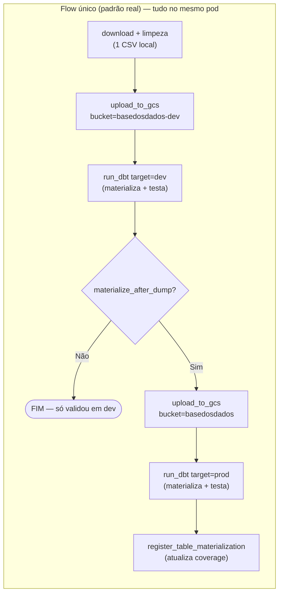
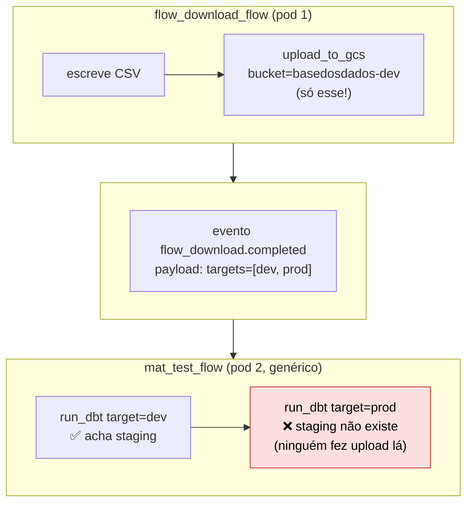
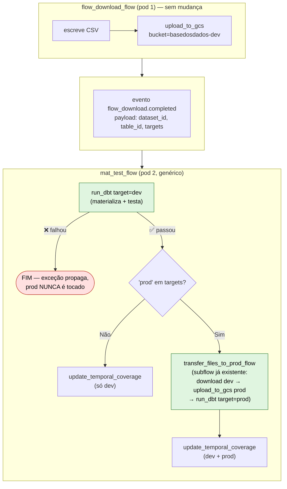

# Staging multi-ambiente (dev/prod) na cadeia de automações

## O problema

No padrão real de um flow único (ex. `pipelines/datasets/br_bcb_estban/flows.py::_run_bcb_estban`),
"baixar e atualizar" e "materializar e testar" andam juntos, **uma vez por
ambiente**, na mesma execução:

O **mesmo CSV local** é subido duas vezes — uma pra cada bucket/projeto
BigQuery (`basedosdados-dev` e `basedosdados` são projetos GCP diferentes,
cada um com seu próprio staging) — e cada upload é seguido do `run_dbt` que
lê *daquele* staging específico.

## O que quebrou ao separar em 3 flows (issue #1867)

Na cadeia de automações, `flow_download` e `mat_test` são **flows/pods
diferentes**. Hoje:

- `flow_download_flow` só faz **um** `upload_to_gcs`, fixo pro bucket dev.
- `mat_test_flow` (genérico) roda `run_dbt` pra **todos os `targets`**
  recebidos (`["dev", "prod"]` por padrão).

**Causa**: o upload pro staging de cada ambiente e o `run_dbt` daquele
mesmo ambiente estavam sempre juntos, na mesma execução, no padrão real.
Ao partir em dois flows separados, só copiamos a parte do `run_dbt`
(múltiplos ambientes) pro `mat_test_flow` — o upload multi-ambiente ficou
pra trás, `flow_download_flow` só faz o de dev.

## Primeira correção proposta — **descartada, insegura**

A ideia inicial era simples: `flow_download_flow` faz um `upload_to_gcs`
por `target` (dev **e** prod, adiantado), e `mat_test_flow` roda `run_dbt`
pra cada um. Só que isso quebra a garantia que o padrão real tem: **prod só
pode ser tocado depois que dev já passou no teste**. Se os dois uploads
acontecem antes de qualquer `run_dbt`, dado **não validado** já fica
sentado no bucket/projeto de produção mesmo que o teste de dev falhe
depois e a cadeia pare no meio — o `if not materialize_after_dump: return`
do `_run_bcb_estban` existe justamente pra evitar isso.

## Solução geral — já existe: `transfer_files_to_prod_flow`

A garantia a preservar: **nada chega no bucket/projeto de produção antes
do teste em dev ter passado**, mesmo com `flow_download` e `mat_test`
rodando em pods diferentes.

Boa notícia: o "baixar do staging de dev + subir no staging de prod" que
esse ciclo precisa **já existe, pronto**, em
`pipelines/utils/materialize_prod/`:

- `download_files_from_bucket_folders` (`tasks.py:12`) — baixa os blobs de
  `gs://basedosdados-dev/staging/<dataset_id>/<table_id>/<folder>/` pra
  disco local (`google.cloud.storage`, download direto, sem passar pelo
  Prefect).
- `transfer_files_to_prod_flow` (`flows.py:91`) — chama a task acima e
  depois `upload_to_gcs(bucket_name="basedosdados", ...)` +
  `run_dbt(target="prod")` (+ `register_table_materialization_task`
  opcional, via `update_metadata=True`) — na ordem certa, com chamada
  direta (não `.submit()`) pra garantir que uma falha propaga e non deixa
  a próxima etapa rodar.

Ou seja: **não precisamos escrever nenhuma função de transferência nova**.
`mat_test_flow` só precisa chamar `transfer_files_to_prod_flow` como
subflow, no lugar de "promover manualmente", depois que `run_dbt(dev)`
já passou:

✅ **Ressalva de partição — corrigida**: `download_files_from_bucket_folders`
exigia `folders: list[str]` (pastas estilo Hive, ex. `mes_competencia=202306/`),
o que não encaixava com tabelas **sem partição** (como o `test_event_pipeline`
do piloto). Passou a aceitar `folders: str | list[str] | None = None` —
`None` baixa direto do prefixo base da tabela
(`staging/{dataset_id}/{table_id}/`), sem subpasta.

✅ **Bug achado pelo usuário — corrigido**: `transfer_files_to_prod_flow`
chamava `run_dbt(dbt_command="run")` pra materializar em prod — **nunca
testava** lá, só materializava. `dbt_command` virou parâmetro (default
`"run"`, preserva o comportamento de quem já chama essa função
manualmente); `mat_test_flow` passa `"run/test"` explicitamente.

✅ **`partition_folders` no payload**: pedido do usuário — "os flows
[devem] passar o dado que eles atualizaram... pra não upar dados
desnecessários e grandes". `mat_test_params` ganhou um campo opcional
`partition_folders`, repassado direto pro `folders` de
`transfer_files_to_prod_flow`. Um dataset particionado só promove a(s)
pasta(s) que `flow_download` acabou de atualizar naquela execução — não a
pasta de staging inteira (que pode ter anos de histórico acumulado).

### Por que isso é a solução certa, não só um workaround

- **Preserva a garantia do padrão real**: prod só é tocado depois que dev
  passou — a promoção pra prod só acontece *dentro* do `mat_test_flow`,
  depois do `run_dbt(dev)`, exatamente onde o `if not materialize_after_dump`
  fica no flow único original.
- **Não reenvia dado grande pelo payload do evento**: o payload continua
  só metadado (`dataset_id`, `table_id`, `targets`, coverage) — o dado em
  si viaja por onde já é feito pra isso (GCS), não pelo Prefect event bus.
- **`flow_download_flow` não muda nada** — continua só baixando e subindo
  pro staging de dev, exatamente como já está implementado hoje no piloto.
- **Generaliza pra qualquer tamanho de dado**: como é uma cópia
  GCS-pra-GCS (bucket pra bucket), não passa pela memória/payload do
  Prefect — funciona igual pra um CSV de 1 linha ou um arquivo de
  gigabytes.

### O que foi implementado

Nenhuma função nova de transferência — só encaixar o que já existia:

- `mat_test_flow` (`pipelines/utils/metadata/flows.py`): trocou o loop
  simples `for target in targets: run_dbt(...)` por
  `run_dbt(target="dev")` **sempre** primeiro; só se `"prod" in targets`,
  chama `transfer_files_to_prod_flow(...)` como subflow. Sem
  `try/except` — a exceção de `run_dbt(dev)` propaga e aborta o flow
  antes de qualquer coisa tocar prod (verificado: `run_dbt` levanta
  `Exception` em falha de `run`/`test`, não engole erro).
- `download_files_from_bucket_folders`/`transfer_files_to_prod_flow`:
  suporte a `folders=None` (sem partição), fallback hardcoded removido,
  `dbt_command` parametrizável — ver seção anterior.

### Viabilidade de teste — checada, não só assumida

Antes de considerar isso "pronto", testei (só leitura,
`bucket.test_iam_permissions`, sem escrever nada) se as credenciais
disponíveis neste ambiente alcançam o projeto `basedosdados` real:

| Credencial | Permissões no bucket `basedosdados` |
|---|---|
| `staging.json` | `storage.objects.get`, `storage.objects.list` (só leitura) |
| `prod.json` | nenhuma |

E `basedosdados.test_dataset_staging` nem existe como dataset no BigQuery
de produção ainda.

**Veredito na hora**: não dava pra testar a transferência dev→prod de
ponta a ponta *deste jeito* — não por bug de código, mas fronteira de
credencial (a service account local de dev não tem escrita em prod, faz
todo sentido de segurança).

### A pergunta que resolveu (2026-09-01)

O usuário perguntou: "nossas automações estão rodando apenas pra flow no
work pool de dev?" — sim. E isso era o ponto: credencial não é algo que
se "passa" pra um script, é o **work pool** que define o secret Kubernetes
disponível no pod (`gcp-credentials`, por namespace). Sem mexer em nenhuma
credencial local, bastou:

1. Redeployar `mat_test_flow`/`update_temporal_coverage` no pool
   **`basedosdados`** (prod) em vez de `basedosdados-dev` — Prefect faz
   upsert do deployment por nome, então o `deployment_id` não mudou e a
   Automação 2 não precisou de ajuste.
2. Trocar o default de `download_billing_project` pra `basedosdados`
   (era `basedosdados-dev`).
3. `TARGETS` do piloto → `["dev", "prod"]`.

Rodou de verdade: upload real em `gs://basedosdados/staging/test_dataset/test_event_pipeline`,
`dbt run/test target=prod` passou com a conta real
`dbt-rpc@basedosdados.iam.gserviceaccount.com`, e
`basedosdados.test_dataset.test_event_pipeline` existe de verdade em
produção com `reference_date` correto. Detalhes completos em
`issue-1867-pipeline-eventos.md`, parte 13.

## Status

**Implementado E testado end-to-end em produção real.** `mat_test_flow`
chama `transfer_files_to_prod_flow` (já existente,
`pipelines/utils/materialize_prod/flows.py`) como subflow, só depois que
`run_dbt(dev)` passa — rodando do pool `basedosdados`, não mais
`basedosdados-dev`. Os dois bugs pré-existentes corrigidos no processo
(`dbt_command` fixo em `"run"`; `folders=None` não suportado) também
foram exercitados de verdade nesse teste. Não é mais teórico.
