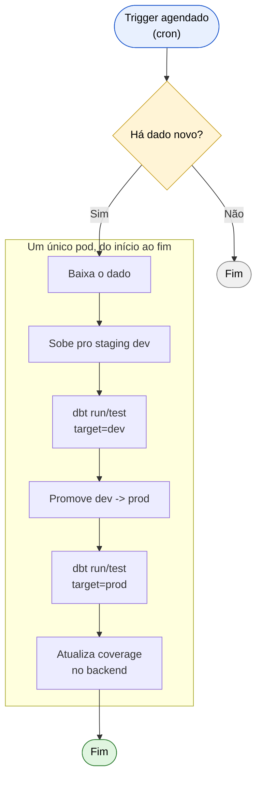
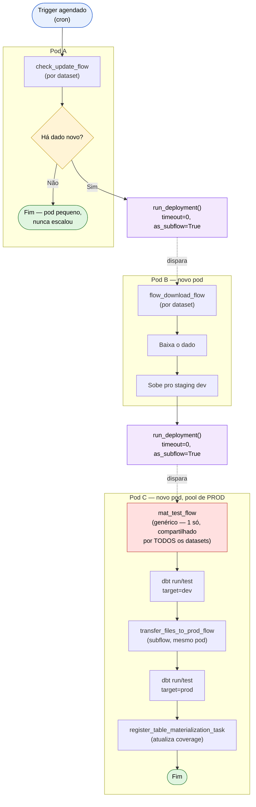
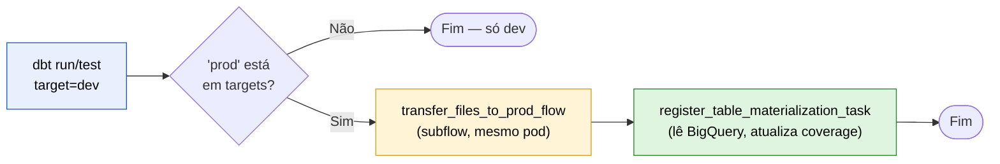

# Pipeline orientado a eventos — visão geral (issue #1867)

Documento-síntese pra apresentação. Consolida o raciocínio e os resultados
espalhados em vários docs desta pasta — pra detalhe completo, ver
[issue-1867-pipeline-eventos.md](./issue-1867-pipeline-eventos.md) (log
cronológico completo, "parte 1" a "parte 16") e os docs específicos
linkados ao longo deste.

Link da issue: https://github.com/basedosdados/pipelines/issues/1867

## O problema

Hoje, um dataset é **um flow monolítico**: checa se há dado novo → baixa
→ sobe pro staging de dev → materializa e testa em dev → promove e
materializa em prod → atualiza metadados. Tudo isso roda **num pod só**,
do início ao fim.

**O problema com isso**: o pod precisa ser dimensionado pro pior caso da
sequência inteira (o passo mais pesado de memória/CPU), mesmo que a
maior parte das execuções pare logo no primeiro `Check` (sem dado novo —
é o caminho mais comum). Não há isolamento de falha entre etapas
independentes, e cada dataset tem seu próprio flow inteiro, do zero,
repetindo a mesma sequência de materialização que é idêntica em todo
dataset.

## A proposta: 3 flows encadeados, cada um no seu pod

Cada etapa é **um deployment separado no Prefect**, e uma dispara a
seguinte chamando `run_deployment()` direto no código — sem esperar ela
terminar (`timeout=0`), então o pod da etapa que disparou fica livre pra
encerrar (ou pegar a próxima execução agendada) imediatamente, e a etapa
seguinte sobe em **seu próprio pod novo**, dimensionado só pro que ela
precisa.

**`mat_test_flow` é genérico**: existe **um único deployment**, reaproveitado
por todos os datasets — não um `mat_test_flow` por dataset. A materialização
+ teste + promoção pra prod + atualização de coverage é sempre exatamente a
mesma sequência, então só os parâmetros mudam (`dataset_id`, `table_id`,
`coverage`, etc.), não o código.

## Como uma etapa dispara a outra: `run_deployment()`

A decisão técnica principal desta rodada foi **como** uma etapa dispara a
próxima. Cogitamos e testamos duas abordagens antes de chegar aqui — a
segunda decisão veio depois de já ter a primeira funcionando de ponta a
ponta, ao perceber que ela não escalaria bem pra ~82 datasets reais:

| | Automação do Prefect (testado, depois abandonado) | `run_deployment()` direto (adotado) |
|---|---|---|
| Onde mora a lógica "quem dispara quem" | Objeto `Automation` separado, configurado fora do código | Dentro do próprio flow, uma chamada de função |
| Passagem de parâmetro | JSON serializado numa string (Jinja do Prefect nunca preserva tipo nativo) | Dict nativo — Pydantic valida automaticamente, sem workaround |
| Escalar pra ~82 datasets | Precisaria de um mecanismo novo pra criar/sincronizar automações em massa | Não precisa de nada novo — a lógica já mora no código de cada dataset |
| Visibilidade no Prefect UI | Flow disparado aparece solto, correlacionado só por tag/tempo | Aparece como **filho de verdade** na árvore de execução (`as_subflow=True`) |
| Isolamento de recurso entre pods | Idêntico | Idêntico — `timeout=0` não bloqueia o pod que disparou |

Testado em produção real, primeira tentativa, sem nenhum ajuste: a cadeia
inteira rodou, cada pod foi criado na hora certa, e o flow disparado
apareceu com lineage real no Prefect UI. Detalhe completo da comparação e
da decisão em
[run-deployment-vs-automacao.md](./run-deployment-vs-automacao.md).

## O que fica dentro do `mat_test_flow` genérico

Se `dbt run/test` em dev falhar, a exceção propaga e o flow para ali — nada
toca prod (mesma garantia que o padrão de flow único já tinha). A
atualização de coverage só acontece **depois** que a promoção pra prod
termina — não em paralelo — porque ela lê o BigQuery pra decidir a nova
cobertura, e ler antes da promoção terminar arriscaria registrar sucesso
com dado desatualizado.

`transfer_files_to_prod_flow` (baixa do staging dev, sobe no staging prod,
roda dbt em prod) já existia no repositório — nunca era chamada de lugar
nenhum antes desta issue. Resolve de forma direta um problema real do
desenho de 3 flows separados: o staging de dev e o de prod agora podem
ficar em pods diferentes, e essa etapa é o que garante que prod só recebe
dado depois que passou pelo teste em dev primeiro. Detalhe em
[staging-multi-ambiente.md](./staging-multi-ambiente.md).

## Vantagens

- **Isolamento de recurso real por etapa.** Um `check_update` leve (a
  execução mais comum, já que a maioria das checagens não acha dado
  novo) nunca paga o custo de memória de um `flow_download`/`mat_test`
  pesado — cada etapa tem seu próprio pod, dimensionado só pro que ela
  precisa.
- **`mat_test_flow` genérico.** Um deployment só, reaproveitado por
  qualquer dataset — não é preciso escrever/manter um `mat_test_flow`
  por dataset; a etapa terminal da issue original virou uma peça de
  infraestrutura compartilhada.
- **Parâmetros tipados de verdade.** `coverage: CoverageSpec` (e todo o
  resto) é validado automaticamente pelo Pydantic no momento em que o
  flow run é criado — sem serialização manual, sem workaround de JSON.
- **Lineage real no Prefect UI.** Um flow disparado aparece como filho de
  verdade na árvore de execução, não só correlacionado por tag/tempo.
- **Zero infraestrutura nova pra manter.** Não existe um mecanismo
  separado de "automações" pra sincronizar conforme datasets são
  migrados — a lógica de disparo é só código Python normal, no mesmo
  lugar onde qualquer um já olharia pra entender o flow.
- **Rerun manual em qualquer etapa, isolado.** `flow_download_flow` e
  `mat_test_flow` podem ser chamados direto (sem passar pelo
  `check_update`) passando os parâmetros à mão — útil pra debug ou
  reprocessar um dataset sem re-executar a checagem.

## O que muda na prática pra quem mantém um dataset

- Um flow monolítico vira **2 flows próprios do dataset**
  (`check_update_flow`, `flow_download_flow`) + o `mat_test_flow`
  genérico compartilhado (nada a escrever ali).
- Convenção de nome de deployment por dataset/etapa
  (`pipelines/utils/stage_dispatch.py::deployment_name`), pra
  `run_deployment()` saber quem chamar sem precisar consultar a API antes.
- `deploy_tags` (`etapa:check_update`, `dataset:<id>`, etc.) continuam
  existindo — não são mais necessários pro disparo em si, mas ajudam a
  achar deployments relacionados no Prefect UI sem abrir código.
- `check_update_and_dispatch` (helper compartilhado) encapsula o padrão
  real de checagem — poll contra a coverage do backend, commit do
  update, disparo da próxima etapa — pra qualquer dataset com esse
  padrão não repetir essa sequência.

## Validado de ponta a ponta, com infraestrutura real

Não é só desenho — a cadeia inteira foi testada contra o Prefect real,
BigQuery real e o backend real (não simulado):

- **Em dev**: `check_update` comparou a data de hoje contra a coverage
  registrada, detectou desatualizado de verdade, disparou `flow_download`,
  que subiu dado real pro staging, que disparou `mat_test`, que rodou
  `dbt run/test` de verdade em dev.
- **Em prod real**: o mesmo caminho, promovendo pra
  `basedosdados.test_dataset.test_event_pipeline` — primeira tabela real
  criada em produção por este piloto, com a conta de serviço de produção
  de verdade (`dbt-rpc@basedosdados.iam.gserviceaccount.com`).
- **A troca de mecanismo de disparo** (automação → `run_deployment()`)
  também foi testada de ponta a ponta depois de implementada — sucesso
  na primeira tentativa, incluindo a confirmação visual do lineage
  (`"Beginning subflow run"` nos logs).

Dois bugs reais foram achados e corrigidos no processo (não específicos
deste piloto — afetavam qualquer flow que usasse os mesmos padrões):

1. Coverage chegando como dict cru em vez de validado pelo Pydantic —
   corrigido, e o design final com `run_deployment()` já não tem essa
   categoria de bug.
2. `rename_flow_run_dataset_table` (renomeia o flow run na UI) nunca
   executava de verdade — bug **repo-wide**, presente em ~63 arquivos
   reais de produção, não só neste piloto. Aberto como issue separada:
   [#1940](https://github.com/basedosdados/pipelines/issues/1940).

## O que falta antes de aplicar aos ~82 datasets reais

Nada do que falta é um bloqueador técnico — a mecânica central já está
provada. São passos operacionais/de rollout:

- **CI de deploy seletivo em prod**: hoje todo push pra `main` redeploya
  **todos** os flows do repositório (~21min medidos hoje); dobrar a
  contagem de flows (migração completa) dobraria esse tempo, em todo
  push, migração relacionada ou não. Decidido mudar pra deploy seletivo
  (só o que mudou no PR), ainda não implementado — issue
  [#1943](https://github.com/basedosdados/pipelines/issues/1943).
- **Decomissionamento da deployment antiga**: migrar um dataset não
  remove o deployment do flow monolítico antigo sozinho — ele continua
  registrado e ativo no Prefect, sem ferramenta pra desligar
  automaticamente.
- **Ativação de schedule é manual**: a arma do `check_update_flow` novo
  (e o desarme do antigo) precisa de um passo manual no Django admin por
  dataset migrado — sem runbook ainda.
- **Variante `check_and_download`**: 49% dos ~82 datasets da issue só
  sabem se há dado novo baixando o arquivo (checagem e download são a
  mesma operação) — essa variante (2 flows, não 3) nunca foi
  prototipada, só o caminho de 3 flows tem código real.

## Referências

- [issue-1867-pipeline-eventos.md](./issue-1867-pipeline-eventos.md) —
  log completo, cronológico, de toda a investigação e implementação.
- [run-deployment-vs-automacao.md](./run-deployment-vs-automacao.md) —
  comparação completa e decisão do mecanismo de disparo.
- [staging-multi-ambiente.md](./staging-multi-ambiente.md) — o problema
  do staging dev/prod partido entre pods, e a solução.
- [automacao-vs-subflow.md](./automacao-vs-subflow.md) — por que 3
  deployments separados (não fundir `check_update`+`flow_download`).
- [como-criar-automacoes.md](./como-criar-automacoes.md) /
  [automacoes-em-massa.md](./automacoes-em-massa.md) — obsoletos pra esta
  issue, mantidos como registro histórico do caminho que foi abandonado.
