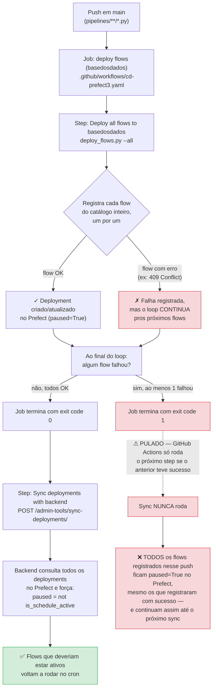

# Fluxograma: como o deploy de flows pra produção funciona hoje

**Data**: 2026-08-24
**Contexto**: preparado pra explicar o problema descrito em [basedosdados/pipelines#1892](https://github.com/basedosdados/pipelines/issues/1892)

Fluxograma de como o deploy de flows pra produção funciona hoje, pra ajudar a visualizar onde exatamente esse problema acontece:

## O incidente real que motivou essa issue

Em 2026-08-21 e novamente em 2026-08-22, um único flow (`br_sfb_sicar_flow`) falhou ao registrar (erro de schema em `job_variables`, ver [#1893](https://github.com/basedosdados/pipelines/issues/1893)). O restante do catálogo (178 outros flows) registrou normalmente, mas como o job inteiro terminou com erro, o step "Sync deployments with backend" nunca rodou — deixando **~150 flows** marcados como "ativos" no backend (Django admin) mas com o deployment pausado no Prefect, ou seja, sem nenhuma atualização automática rodando, sem nenhum alerta visível fora do log dessa action.

## A correção proposta

`if: always()` no step "Sync deployments with backend" — muda o ramo pontilhado do diagrama: mesmo quando o job termina com erro (`I`), o sync passaria a rodar do mesmo jeito, assim uma falha isolada num flow não impede a reativação de todos os outros que já registraram certo no mesmo push.

## Peças envolvidas

- `.github/workflows/cd-prefect3.yaml` — o workflow, dois steps: `Deploy all flows to basedosdados` e `Sync deployments with backend`
- `.github/scripts/deploy_flows.py` — script que itera o catálogo inteiro (`--all`) e registra cada flow via `flow.deploy(...)`, `paused=True` sempre por padrão
- `backend/apps/admin_data_tools/views.py::SyncDeploymentsView` — endpoint chamado pelo segundo step; consulta todos os deployments do Prefect e aplica `paused = not is_schedule_active` conforme o registro `DisabledFlowSchedule` no banco do backend
