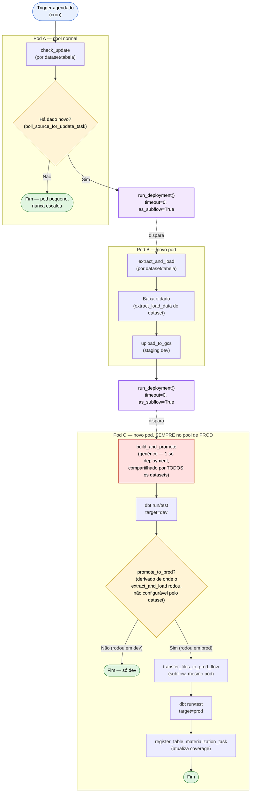

# Como migrar um dataset pro pipeline orientado a eventos (guia atual)

Guia prático, verificado contra o código real, pra quem vai migrar um
dataset novo. Pra contexto histórico completo (por que essa arquitetura,
o caminho até chegar nela): [issue-1867-pipeline-eventos.md](../../tasks/pipelines/issue_1867/issue-1867-pipeline-eventos.md)
e a issue [basedosdados/pipelines#1867](https://github.com/basedosdados/pipelines/issues/1867)
(seção "Status atual (2026-09-30)").

## Visão geral

Um dataset migrado vira **2 ou 3 flows encadeados**, cada um no seu
próprio pod, em vez de um flow monolítico fazendo tudo numa execução só:



Duas diferenças importantes em relação ao fluxograma antigo
(`visao-geral-pipeline-eventos.md`), ambas confirmadas no código atual:

1. **Nomes das etapas**: `check_update` → `extract_and_load` →
   `build_and_promote` (antes `check_update`/`flow_download`/`mat_test` —
   renomeado na revisão de `pipelines#1932`).
2. **Mecanismo de disparo**: uma etapa chama `run_deployment()` **direto
   no próprio código** (`timeout=0`, `as_subflow=True`) pra disparar a
   próxima. **Não existe mais Automação do Prefect 3 + `emit_event()`** —
   esse caminho foi testado, funcionou, mas foi abandonado por não
   escalar bem pra ~82 datasets (ver
   [run-deployment-vs-automacao.md](../../tasks/pipelines/issue_1867/run-deployment-vs-automacao.md)
   pra comparação completa).

## As duas variantes

| Variante | Flows | Status |
|---|---|---|
| **Padrão** — check é uma chamada leve (HEAD, API de metadata, listagem FTP) | `check_update` → `extract_and_load` → `build_and_promote` | **Implementada**, código real em `pipelines/utils/stage_dispatch.py`, 6+ datasets migrados de verdade |
| **`check_and_download`** — só dá pra saber se há dado novo baixando o arquivo | `check_and_download` → `build_and_promote` | **Não implementada.** Nenhum código real ainda, só proposta na issue. Se o dataset do seu colega cair nessa categoria, isso precisa ser prototipado primeiro — ver a lista de datasets por categoria na issue #1867 |

Se não souber em qual categoria o dataset cai, a issue
[#1867](https://github.com/basedosdados/pipelines/issues/1867) tem a
lista nominal completa dos ~82 datasets, classificados (seção
"Recontagem nominal").

## Passo a passo (variante padrão), com exemplo real

Exemplo completo e já em produção: `br_ibge_ipca`
(`pipelines/datasets/br_ibge_ipca/`). Um dataset multi-tabela usa
`pipeline_factory` pra não repetir a fiação por tabela; um dataset de
tabela única pode usar `CheckThenExtractLoadPipeline` direto.

### 1. `constants.py` — IDs

```python
DATASET_ID = "br_ibge_ipca"
MES_BRASIL_TABLE_ID = "mes_brasil"
# ... uma constante por tabela, se multi-tabela
```

### 2. `tasks.py` — a lógica específica do dataset

Duas funções (ou fábricas de função, se multi-tabela) com a lógica real:

```python
from pipelines.utils.stage_dispatch import (
    ExtractAndLoad, SourceInspection, pipeline_factory,
)

def make_get_latest_update(table_id):
    def get_latest_update() -> SourceInspection:
        # ... descobre a data mais recente na fonte
        return SourceInspection(reference_date=data_encontrada)
    return get_latest_update

def make_extract_load_data(table_id):
    def extract_load_data(download_params: dict) -> ExtractAndLoad:
        ref = download_params["reference_date"]
        # ... baixa o dado de verdade a partir de ref
        return ExtractAndLoad(coverage=COVERAGE.model_dump(), data_path=caminho_local)
    return extract_load_data

make_pipeline = pipeline_factory(DATASET_ID, make_get_latest_update, make_extract_load_data)
```

Pontos que já causaram bug em migrações reais:
- `get_latest_update` **só informa** a data encontrada — não decide se é
  "nova". Quem decide é `poll_source_for_update_task`, chamado por
  dentro de `check_update_and_dispatch`.
- `extract_load_data` **não chama `upload_to_gcs` diretamente** — a
  cápsula (`CheckThenExtractLoadPipeline.run_extract_and_load`) já faz
  isso depois.
- Tabela particionada: `data_path` precisa ser um diretório já na
  estrutura Hive final (`data_path/ano=2026/mes=09/arquivo.csv`) — não é
  um parâmetro que você passa pro `ExtractAndLoad`, é descoberto sozinho
  (`discover_partition_folders`).

### 3. `flows.py` — a fiação

```python
from pipelines.utils.flow import flow
from pipelines.utils.stage_dispatch import Etapa, deploy_tags
from prefect.schedules import Cron

_pipeline = make_pipeline(MES_BRASIL_TABLE_ID)

@flow(name=_pipeline.check_update_flow_name, log_prints=True)
def br_ibge_ipca_mes_brasil_check_update() -> None:
    _pipeline.run_check_update()

br_ibge_ipca_mes_brasil_check_update.deploy_tags = deploy_tags(
    DATASET_ID, Etapa.CHECK_UPDATE, MES_BRASIL_TABLE_ID
)
br_ibge_ipca_mes_brasil_check_update.deploy_schedules = [
    Cron("40 14 8,9,10,11,12,13 * *", timezone="America/Sao_Paulo")
]

@flow(name=_pipeline.extract_and_load_flow_name, log_prints=True)
def br_ibge_ipca_mes_brasil_download(download_params: dict) -> None:
    _pipeline.run_extract_and_load(download_params)

br_ibge_ipca_mes_brasil_download.deploy_tags = deploy_tags(
    DATASET_ID, Etapa.EXTRACT_AND_LOAD, MES_BRASIL_TABLE_ID
)
_pipeline.extract_load_deployment = br_ibge_ipca_mes_brasil_download.fn.__name__
```

Repare: **não existe `build_and_promote` no `flows.py` do dataset.** É
um único deployment genérico, já existente
(`pipelines/utils/metadata/flows.py`), compartilhado por todos os
datasets — `extract_and_load` dispara ele sozinho
(`dispatch_build_and_promote`, dentro de `run_extract_and_load`).

## Peças-chave (referência rápida)

Todas em `pipelines/utils/stage_dispatch.py`, com docstrings completas —
ler o arquivo direto é a fonte de verdade mais atual que existe:

- **`Etapa`** (enum): `CHECK_UPDATE`, `EXTRACT_AND_LOAD`, `BUILD_AND_PROMOTE`.
- **`SourceInspection`**: o que `get_latest_update` devolve —
  `reference_date`, `extra_download_params`, `compare_against`
  (`"coverage"` padrão, ou `"table_update"` pra tabelas `NonHistorical`).
- **`ExtractAndLoad`**: o que `extract_load_data` devolve — `coverage`,
  `data_path`, `prefect_mode`, `dump_mode`, `source_format`.
  `partition_folders` é preenchido sozinho, nunca pelo dataset.
- **`deploy_tags(dataset_id, etapa, table_id=None)`**: convenção de tags
  — sempre inclua `table_id` se o dataset tem mais de uma tabela (é o que
  o backend usa pra vincular `Table.flow_schedule`, ver seção abaixo).
- **`CheckThenExtractLoadPipeline`**: a interface recomendada — encapsula
  todo o boilerplate (rename do flow run, poll/commit/dispatch). Use
  direto pra dataset de tabela única, ou via `pipeline_factory` pra
  multi-tabela.
- **`dispatch_build_and_promote`**: `promote_to_prod` **nunca** é
  configurado pelo dataset — é derivado de onde o `extract_and_load`
  rodou (`_dev_prefix()`). Um teste em dev nunca promove pra prod de
  verdade, por garantia estrutural, não por configuração.
- **Tag `env:dev`/`env:prod`**: lida em runtime (`_dev_prefix`) pra
  resolver o prefixo `dev-` do próximo deployment a disparar — sem isso,
  um dispatch em dev tentaria achar o deployment de prod.

## Depois de implementar: deploy e ativação

1. Push pra `main` dispara o deploy em produção — **seletivo**, só os
   flows que mudaram no PR (resolvido por `pipelines#1943`; antes disso
   redeployava tudo, ~21min a cada push).
2. Todo deployment novo nasce **pausado** (`is_schedule_active=False`).
   O step "Sync deployments with backend" do CI (`cd-prefect3.yaml`)
   registra isso no backend (`DisabledFlowSchedule`) logo depois do
   deploy.
3. **Ativar o schedule**: pelo admin do backend (checkbox com
   confirmação, ou as ações em massa "Ativar/Desativar agendamento
   selecionado(s)") — ou via `mcp__databasis__set_deployment_schedule_active`.
   **Nunca** despausar direto no Prefect: o próximo sync reimpõe o estado
   salvo no backend e re-pausaria silenciosamente.
4. **Novidade (2026-10-07, `backend#1112`/`#1113`)**: toda `Table` agora
   mostra, no próprio admin, qual `Flow Schedule` a alimenta (campo
   "Flow"), e todo `Flow Schedule` mostra quais tabelas ele alimenta
   (campo "Tables") — útil pra achar/conferir o deployment certo sem
   precisar procurar por nome no Prefect.

## Pendências conhecidas que ainda afetam uma migração nova

- **Deployment monolítico antigo não é removido sozinho**: migrar um
  dataset não desliga o flow antigo — ele continua registrado e ativo
  (ou pausado, mas presente) no Prefect. Precisa pausar/deletar
  manualmente depois de confirmar que o novo está funcionando. Exemplo
  real confirmado: todo o conjunto antigo do `br_ms_cnes`
  (`br_ms_cnes__equipe`, `br_ms_cnes__equipamento`, etc.) ainda existe no
  Prefect, paralelo aos flows novos.
- **Variante `check_and_download` sem código real** — ver tabela acima.
- **`br_bcb_sicor` bloqueado**: compara atualização por tamanho de
  arquivo, não por data — `stage_dispatch.py` não cobre esse caso ainda.
- **`poll_source_for_update` quebra pra tabela sem `RawDataSource`
  cadastrado** (filtro GraphQL `rawDataSource_Id: null` é ignorado) —
  sem issue própria aberta ainda.
- **`bd.Table.create()` só registra o ponteiro externo do BigQuery em
  `basedosdados-staging`, nunca em `basedosdados-dev`** — se a tabela for
  nova, pode exigir criação manual em dev (`pipelines#1967`, aberta).

Detalhe e mais contexto de cada item: [backlog.md](../../investigacoes/pipelines/backlog.md).

## Onde está o resto da história

- [issue #1867](https://github.com/basedosdados/pipelines/issues/1867)
  (GitHub) — estado consolidado mais atual (seção "Status atual
  (2026-09-30)") e a lista nominal dos ~82 datasets por categoria/dificuldade.
- `pipelines#1932` — PR da migração real, revisão completa e tabelas de teste.
- [backlog.md](../../investigacoes/pipelines/backlog.md) (este repo) —
  pendências em aberto, reconferidas periodicamente contra o código.
- [issue-1867-pipeline-eventos.md](../../tasks/pipelines/issue_1867/issue-1867-pipeline-eventos.md)
  (este repo) — log cronológico da investigação/implementação original.
  **Nomenclatura antiga** (`flow_download`/`mat_test`) e **mecanismo
  antigo** (Automação do Prefect 3, não `run_deployment()`) até a "parte
  16" — útil como registro histórico de como se chegou aqui, não como
  referência de como construir um flow hoje.
