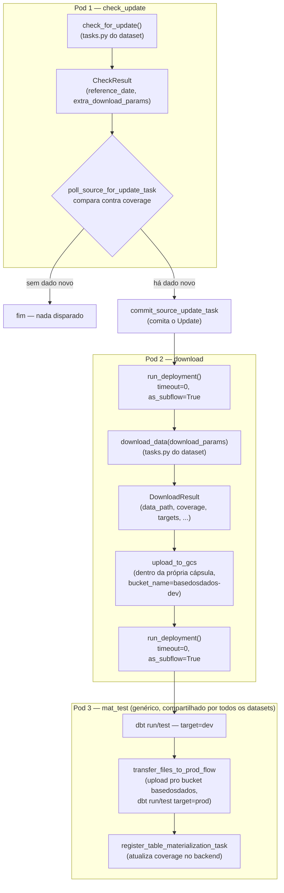

# Pipeline orientado a eventos — fluxo e nomenclatura dos flows

Referência de como a arquitetura da issue #1867 (`check_update` → `download` → `mat_test`) é encadeada de verdade no Prefect, e de onde vem cada pedaço do nome de cada flow/deployment. Complementa a documentação de desenho em `tasks/pipelines/issue_1867/` (histórico de decisões) — este arquivo é a referência do estado atual, pra consultar rápido sem reconstruir o raciocínio.

Código-fonte de tudo aqui: `pipelines/utils/stage_dispatch.py` (repo `pipelines`).

## Fluxograma



Cada pod é uma execução de flow independente — `run_deployment(..., timeout=0)` não espera o próximo terminar, e `as_subflow=True` só faz o run aparecer linkado na árvore do Prefect UI (lineage), não implica execução no mesmo pod.

## Onde cada parte do código mora

| Arquivo | Conteúdo |
|---|---|
| `pipelines/utils/stage_dispatch.py` | Genérico, compartilhado por todos os datasets: `Etapa`, `CheckResult`/`DownloadResult`, `deploy_tags`, `deployment_name`/`_flow_name`, `check_update_and_dispatch`, `dispatch_mat_test`, `CheckThenDownloadPipeline`. |
| `pipelines/utils/metadata/flows.py` | `mat_test_flow` — único, genérico, reaproveitado por todo dataset na variante padrão. |
| `pipelines/datasets/<dataset>/constants.py` | `DATASET_ID` + um `*_TABLE_ID` por tabela. Só literais (strings, dicts, enums) — nunca importa de `tasks.py` (ver "Por que `make_pipeline` não vai pra `constants.py`" abaixo). |
| `pipelines/datasets/<dataset>/tasks.py` | `check_for_update`/`download_data` (a lógica específica do dataset) **e** `make_pipeline` (a fábrica de `CheckThenDownloadPipeline` já configurada pro dataset). Nunca chama `upload_to_gcs` diretamente. |
| `pipelines/datasets/<dataset>/flows.py` | Só a fiação: `_x_pipeline = make_pipeline(TABLE_ID)` + os `@flow`. **Nenhuma lógica de negócio aqui**, nem a construção da fábrica em si (isso mora em `tasks.py`). |

## Nomenclatura

### `prefect_dataset_id`

Sempre `f"{dataset_id}__{table_id}"` (dois underscores) — derivado automaticamente por `CheckThenDownloadPipeline`, **mesmo quando o dataset só tem uma tabela**. Não é um caso especial de multi-tabela: é a convenção universal do repo, confirmada em datasets reais que já seguiam esse padrão antes da issue #1867 (`br_bcb_agencia__agencia`, `br_denatran_frota__uf_tipo`, `br_rf_cno__<table_id>`).

```
dataset_id = "br_ibge_ipca"
table_id   = "mes_brasil"
→ prefect_dataset_id = "br_ibge_ipca__mes_brasil"
```

### Nome do `@flow`

Formato: **`f"{etapa}: {prefect_dataset_id}"`** — a etapa vem primeiro. Montado por `_flow_name()`, exposto via `CheckThenDownloadPipeline.check_update_flow_name`/`.download_flow_name` (properties — usar direto em `@flow(name=...)`, nunca montar o f-string à mão).

```
check_update: br_ibge_ipca__mes_brasil
download: br_ibge_ipca__mes_brasil
```

Exceção: `mat_test` não segue esse formato — é `@flow(name="mat_test")`, sem dataset nenhum no nome, porque é um deployment único e genérico (não existe "mat_test de tal dataset").

### Nome do deployment (a metade depois da barra)

**É o nome da variável Python no módulo** que guarda o `@flow` — não vem de `_flow_name`/nenhuma convenção de string. `deploy_flows.py` descobre flows via `vars(module).items()` e usa essa chave como `name=` em `.deploy()`. Então o nome real do deployment é literalmente como você nomeou a função/variável em `flows.py`:

```python
@flow(name=pipeline.download_flow_name, log_prints=True)
def br_ibge_ipca_mes_brasil_download_flow(download_params: dict) -> None:
    ...
```
→ deployment se chama `br_ibge_ipca_mes_brasil_download_flow`.

### Identificador completo pro dispatch

`deployment_name(dataset_id, etapa, deployment=None)` monta `f"{flow_name}/{deployment_name}"` — o mesmo formato que `run_deployment(name=...)` espera:

```
download: br_ibge_ipca__mes_brasil/br_ibge_ipca_mes_brasil_download_flow
```

Por padrão, `deployment_name()` assume que a variável se chama `f"{etapa}_flow"` (ex. `download_flow`) — funciona de graça **só quando há um dataset por arquivo** (o caso mais comum). Quando várias tabelas/pilotos dividem o mesmo `flows.py`, cada `@flow` precisa de nome de variável próprio, e o `check_update` correspondente precisa saber qual — daí o parâmetro `download_deployment` em `CheckThenDownloadPipeline`.

### `download_deployment` — como resolver o nome certo sem repetir string

Setado **depois** que o flow existe, a partir do `.fn.__name__` da própria função — nunca uma string digitada à mão (evita duas grafias do mesmo nome divergindo silenciosamente, mesmo motivo do `Etapa(StrEnum)`):

```python
_pipeline.download_deployment = br_ibge_ipca_mes_brasil_download_flow.fn.__name__
```

⚠️ **Não funciona com fábrica compartilhada de `@flow`**: se o `@flow` de download vier de um template de closure reusado pra várias tabelas (`def download_flow(...)` definido uma vez dentro de uma função-fábrica), todas as instâncias têm o **mesmo** `.fn.__name__` literal, mesmo atribuídas a variáveis de módulo diferentes — uma função não sabe a que nome foi atribuída no escopo de quem a criou. Por isso, quando um dataset tem várias tabelas (ex. `br_ibge_ipca`, 4 tabelas), os `@flow` são escritos explicitamente um por um em `flows.py` — só a lógica em `tasks.py` (`check_for_update`/`download_data`) e a construção do `CheckThenDownloadPipeline` usam fábrica, porque esses não têm essa restrição.

### Tags de deploy

`deploy_tags(dataset_id, etapa)` → `[str(etapa), f"dataset:{dataset_id}"]`. Usa sempre o `dataset_id` real (não o `prefect_dataset_id`) — assim todas as tabelas de um mesmo dataset compartilham a tag `dataset:X`, permitindo achar "tudo desse dataset" no Prefect UI independente de quantas tabelas ele tenha.

## Exemplo completo — `br_ibge_ipca`, tabela `mes_brasil`

| Conceito | Valor |
|---|---|
| `dataset_id` | `br_ibge_ipca` |
| `table_id` | `mes_brasil` |
| `prefect_dataset_id` | `br_ibge_ipca__mes_brasil` |
| Nome do `@flow` (check_update) | `check_update: br_ibge_ipca__mes_brasil` |
| Nome do `@flow` (download) | `download: br_ibge_ipca__mes_brasil` |
| Nome da variável/deployment (check_update) | `br_ibge_ipca_mes_brasil_check_update_flow` |
| Nome da variável/deployment (download) | `br_ibge_ipca_mes_brasil_download_flow` |
| Identificador de dispatch pro download | `download: br_ibge_ipca__mes_brasil/br_ibge_ipca_mes_brasil_download_flow` |
| Identificador de dispatch pro mat_test | `mat_test/mat_test_flow` (sempre igual, qualquer dataset) |
| Tags (ambos os flows) | `["check_update", "dataset:br_ibge_ipca"]` / `["download", "dataset:br_ibge_ipca"]` |

## Regras de migração — convenções fixadas na prática

Estabelecidas ao longo da migração de `br_ibge_ipca` + 10 datasets reais (2026-09). Não são só estilo — cada uma resolve um problema real que apareceu (ver o "porquê" em cada uma).

### `pipeline_factory()` — fábrica de `CheckThenDownloadPipeline` por dataset

Quando um dataset tem mais de uma tabela, o construtor de `CheckThenDownloadPipeline` (`dataset_id`, `date_format`, `compare_against`, ...) se repetiria idêntico por tabela. `pipeline_factory()` (em `stage_dispatch.py`) resolve isso: fixa o que é comum ao dataset inteiro, devolve uma função `table_id -> CheckThenDownloadPipeline`.

```python
# tasks.py
make_pipeline = pipeline_factory(
    DATASET_ID,
    make_check_for_update,   # ou uma função só, se o check for compartilhado — ver abaixo
    make_download_data,
    date_format="%Y-%m",     # kwargs comuns a todas as tabelas
)
```

```python
# flows.py
from pipelines.datasets.meu_dataset.tasks import make_pipeline

_minha_tabela_pipeline = make_pipeline(MINHA_TABELA_TABLE_ID)
```

**Regra: `make_pipeline = pipeline_factory(...)` mora em `tasks.py`, sempre como a última definição do arquivo** — não em `flows.py`, e não em `constants.py`.

- **Por que não em `flows.py`**: apesar de "parecer" fiação (é montado uma vez só, sem variar por tabela), ele efetivamente une as funções de `tasks.py` (`make_check_for_update`/`make_download_data`) — deixá-lo em `tasks.py` completa a ideia de "tudo que envolve lógica/composição do dataset mora aqui", e deixa `flows.py` ainda mais enxuto (só a chamada `make_pipeline(TABLE_ID)` + os `@flow`).
- **Por que não em `constants.py`**: geraria import circular. `tasks.py` já importa de `constants.py` (`DATASET_ID`, `*_TABLE_ID`); se `constants.py` importasse de volta `make_check_for_update`/`make_download_data` de `tasks.py` pra montar a fábrica, seria um ciclo. Além disso, `constants.py` é só literais (strings, dicts, enums) — `make_pipeline` é uma fábrica (carrega comportamento), não dado estático.
- **Por que "sempre por último"**: ele compõe o que foi definido acima (`make_check_for_update`/`make_download_data`) — vem depois das peças que monta, mesmo padrão de "defina as peças, monte por último". Facilita achar rápido: quem abre um `tasks.py` novo já sabe que a última definição é a fábrica pronta pra `flows.py` importar.

**Quando o check é uma função só, compartilhada por todas as tabelas** (a fonte não distingue por tabela — ex. `br_me_caged`, `br_me_comex_stat`, um único endpoint/página de metadados pra todas): passe `lambda _table_id: minha_funcao_unica` no lugar da fábrica de check. `pipeline_factory` sempre chama `check_for_update_factory(table_id)`, então precisa de um `Callable[[str], ...]` mesmo quando `table_id` é ignorado.

### Nunca fábrica de `@flow` compartilhada

Ver seção "`download_deployment`" acima — `.fn.__name__` de uma closure criada dentro de uma função-fábrica é sempre o mesmo literal, não importa a quantas variáveis de módulo diferentes ela seja atribuída. Por isso os `@flow` em `flows.py` são sempre escritos explicitamente, um bloco por tabela — só a lógica em `tasks.py` (`make_check_for_update`/`make_download_data`/`make_pipeline`) usa fábrica.

### Banner de comentário por tabela

Cada seção de tabela em `flows.py` abre com um banner mostrando o nome completo dos dois flows que ali são registrados — não só o nome curto da tabela:

```python
# ──────────────────────────────────────────────────────────────────────────────
# mes_brasil
# check_update: br_ibge_ipca__mes_brasil
# download: br_ibge_ipca__mes_brasil
# ──────────────────────────────────────────────────────────────────────────────

_mes_brasil_pipeline = make_pipeline(MES_BRASIL_TABLE_ID)


@flow(name=_mes_brasil_pipeline.check_update_flow_name, log_prints=True)
def br_ibge_ipca_mes_brasil_check_update_flow() -> None:
    ...
```

A construção do pipeline (`_x_pipeline = make_pipeline(TABLE_ID)`) fica **dentro** da seção da própria tabela, logo abaixo do banner — não aglomerada no topo do arquivo, mesmo quando há muitas tabelas (ex. `br_ms_cnes`, 13). Cada seção fica autocontida: banner, pipeline, os dois `@flow`.

### Sempre inspecionar o código real antes de migrar

O levantamento de datasets (`levantamento-datasets-por-categoria-de-check.md`) é um bom ponto de partida, mas **errou a contagem de tabelas em 3 datasets diferentes** durante essa migração (`br_denatran_frota`: 2 tabelas, não 1; `br_ibge_ipca`: 4, não 1; `br_sfb_sicar`: 9, não 1) e classificou pelo menos 2 checks como "leves" quando na verdade dependiam de baixar dado antes de checar (`br_ibge_ipca`, `br_inmet_bdmep`). Regra prática: nunca migrar um dataset só a partir do levantamento — sempre abrir o `flows.py`/`tasks.py`/`crawler/` reais primeiro.

### Validação mínima antes de considerar uma migração "pronta" (mesmo que preliminar)

1. `uv run ruff check` + `uv run ruff format` nos 3 arquivos.
2. `uv run pyrefly check` nos 3 arquivos.
3. Import de sanidade + checagem de colisão de nome — não basta importar sem erro, também confirmar que nenhum `@flow`/nome de deployment colide com outro dataset já migrado:

```python
import importlib, pathlib
from prefect import Flow

mod = importlib.import_module("pipelines.datasets.<dataset>.flows")
path = pathlib.Path(mod.__file__).resolve()
flows = [(n, o) for n, o in vars(mod).items() if isinstance(o, Flow) and o.fn.__code__.co_filename == str(path)]
print(len(flows), [o.name for _, o in flows])
```

Isso é validação estática — não substitui testar contra a fonte/backend real antes de deployar de verdade (passo separado, feito dataset por dataset).

### Segurança de deploy — nunca deixar o flow antigo coexistir

Se o dataset já tinha um flow monolítico antigo com deployments reais em produção: **remover o código antigo do arquivo antes de qualquer deploy pela branch de trabalho**. `deploy_flows.py --files <arquivo>` redeploya todo `Flow` que encontrar nele, usando a branch informada como fonte git do deployment (`GitRepository(branch=...)`); se o flow antigo continuar no arquivo, o deploy sobrescreve silenciosamente a fonte do deployment real de produção (que deveria continuar apontando pra `main`) pra apontar pra branch de trabalho — sem aviso, na primeira vez que o deploy rodar.

## Checklist pra migrar um dataset novo

1. Abrir o código real do dataset (`pipelines/datasets/<dataset>/` e/ou `pipelines/crawler/<nome>/`) — nunca confiar só no levantamento pra saber quantas tabelas tem ou se o check é leve de verdade.
2. `constants.py`: `DATASET_ID` + um `*_TABLE_ID` por tabela.
3. `tasks.py`: `make_check_for_update`/`make_download_data` (fábricas por `table_id`, ou uma função só se o check for compartilhado) + `make_pipeline = pipeline_factory(...)` como última definição do arquivo. Nunca chamar `upload_to_gcs` aqui.
4. `flows.py`: por tabela — banner de comentário (nome da tabela + nome completo dos 2 flows) → `_x_pipeline = make_pipeline(TABLE_ID)` → os 2 `@flow` **explícitos** (nunca via fábrica de flows) usando `.check_update_flow_name`/`.download_flow_name`, `deploy_tags(DATASET_ID, Etapa.CHECK_UPDATE/DOWNLOAD)`, e `pipeline.download_deployment = <flow>.fn.__name__` logo depois do `@flow` de download existir.
5. Se havia flow monolítico antigo com deployments reais em produção: remover do arquivo por completo (ver "Segurança de deploy" acima).
6. Rodar a validação mínima (ruff/pyrefly/import+colisão) antes de considerar pronto.
