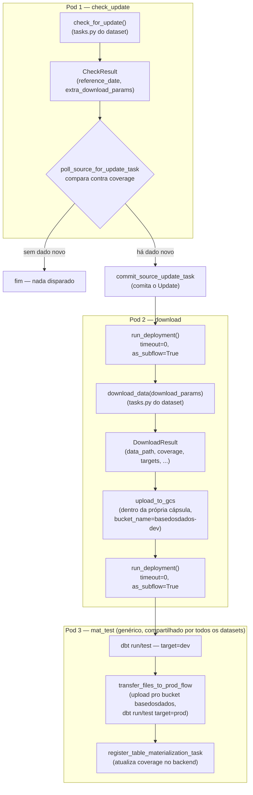

# Pipeline orientado a eventos — fluxo e nomenclatura dos flows

Referência de como a arquitetura da issue #1867 (`check_update` → `download` → `mat_test`) é encadeada de verdade no Prefect, e de onde vem cada pedaço do nome de cada flow/deployment. Complementa a documentação de desenho em `tasks/pipelines/issue_1867/` (histórico de decisões) — este arquivo é a referência do estado atual, pra consultar rápido sem reconstruir o raciocínio.

Código-fonte de tudo aqui: `pipelines/utils/stage_dispatch.py` (repo `pipelines`).

## Fluxograma



Cada pod é uma execução de flow independente — `run_deployment(..., timeout=0)` não espera o próximo terminar, e `as_subflow=True` só faz o run aparecer linkado na árvore do Prefect UI (lineage), não implica execução no mesmo pod.

## Onde cada parte do código mora

| Arquivo | Conteúdo |
|---|---|
| `pipelines/utils/stage_dispatch.py` | Genérico, compartilhado por todos os datasets: `Etapa`, `CheckResult`/`DownloadResult`, `deploy_tags`, `deployment_name`/`_flow_name`, `check_update_and_dispatch`, `dispatch_mat_test`, `CheckThenDownloadPipeline`. |
| `pipelines/utils/metadata/flows.py` | `mat_test_flow` — único, genérico, reaproveitado por todo dataset na variante padrão. |
| `pipelines/datasets/<dataset>/constants.py` | `DATASET_ID` + um `*_TABLE_ID` por tabela. |
| `pipelines/datasets/<dataset>/tasks.py` | `check_for_update`/`download_data` — a lógica específica do dataset (o que baixar, como). Nunca chama `upload_to_gcs` diretamente. |
| `pipelines/datasets/<dataset>/flows.py` | Só a fiação: constrói `CheckThenDownloadPipeline` e declara os `@flow`. **Nenhuma lógica de negócio aqui.** |

## Nomenclatura

### `prefect_dataset_id`

Sempre `f"{dataset_id}__{table_id}"` (dois underscores) — derivado automaticamente por `CheckThenDownloadPipeline`, **mesmo quando o dataset só tem uma tabela**. Não é um caso especial de multi-tabela: é a convenção universal do repo, confirmada em datasets reais que já seguiam esse padrão antes da issue #1867 (`br_bcb_agencia__agencia`, `br_denatran_frota__uf_tipo`, `br_rf_cno__<table_id>`).

```
dataset_id = "br_ibge_ipca"
table_id   = "mes_brasil"
→ prefect_dataset_id = "br_ibge_ipca__mes_brasil"
```

### Nome do `@flow`

Formato: **`f"{etapa}: {prefect_dataset_id}"`** — a etapa vem primeiro. Montado por `_flow_name()`, exposto via `CheckThenDownloadPipeline.check_update_flow_name`/`.download_flow_name` (properties — usar direto em `@flow(name=...)`, nunca montar o f-string à mão).

```
check_update: br_ibge_ipca__mes_brasil
download: br_ibge_ipca__mes_brasil
```

Exceção: `mat_test` não segue esse formato — é `@flow(name="mat_test")`, sem dataset nenhum no nome, porque é um deployment único e genérico (não existe "mat_test de tal dataset").

### Nome do deployment (a metade depois da barra)

**É o nome da variável Python no módulo** que guarda o `@flow` — não vem de `_flow_name`/nenhuma convenção de string. `deploy_flows.py` descobre flows via `vars(module).items()` e usa essa chave como `name=` em `.deploy()`. Então o nome real do deployment é literalmente como você nomeou a função/variável em `flows.py`:

```python
@flow(name=pipeline.download_flow_name, log_prints=True)
def br_ibge_ipca_mes_brasil_download_flow(download_params: dict) -> None:
    ...
```
→ deployment se chama `br_ibge_ipca_mes_brasil_download_flow`.

### Identificador completo pro dispatch

`deployment_name(dataset_id, etapa, deployment=None)` monta `f"{flow_name}/{deployment_name}"` — o mesmo formato que `run_deployment(name=...)` espera:

```
download: br_ibge_ipca__mes_brasil/br_ibge_ipca_mes_brasil_download_flow
```

Por padrão, `deployment_name()` assume que a variável se chama `f"{etapa}_flow"` (ex. `download_flow`) — funciona de graça **só quando há um dataset por arquivo** (o caso mais comum). Quando várias tabelas/pilotos dividem o mesmo `flows.py`, cada `@flow` precisa de nome de variável próprio, e o `check_update` correspondente precisa saber qual — daí o parâmetro `download_deployment` em `CheckThenDownloadPipeline`.

### `download_deployment` — como resolver o nome certo sem repetir string

Setado **depois** que o flow existe, a partir do `.fn.__name__` da própria função — nunca uma string digitada à mão (evita duas grafias do mesmo nome divergindo silenciosamente, mesmo motivo do `Etapa(StrEnum)`):

```python
_pipeline.download_deployment = br_ibge_ipca_mes_brasil_download_flow.fn.__name__
```

⚠️ **Não funciona com fábrica compartilhada de `@flow`**: se o `@flow` de download vier de um template de closure reusado pra várias tabelas (`def download_flow(...)` definido uma vez dentro de uma função-fábrica), todas as instâncias têm o **mesmo** `.fn.__name__` literal, mesmo atribuídas a variáveis de módulo diferentes — uma função não sabe a que nome foi atribuída no escopo de quem a criou. Por isso, quando um dataset tem várias tabelas (ex. `br_ibge_ipca`, 4 tabelas), os `@flow` são escritos explicitamente um por um em `flows.py` — só a lógica em `tasks.py` (`check_for_update`/`download_data`) e a construção do `CheckThenDownloadPipeline` usam fábrica, porque esses não têm essa restrição.

### Tags de deploy

`deploy_tags(dataset_id, etapa)` → `[str(etapa), f"dataset:{dataset_id}"]`. Usa sempre o `dataset_id` real (não o `prefect_dataset_id`) — assim todas as tabelas de um mesmo dataset compartilham a tag `dataset:X`, permitindo achar "tudo desse dataset" no Prefect UI independente de quantas tabelas ele tenha.

## Exemplo completo — `br_ibge_ipca`, tabela `mes_brasil`

| Conceito | Valor |
|---|---|
| `dataset_id` | `br_ibge_ipca` |
| `table_id` | `mes_brasil` |
| `prefect_dataset_id` | `br_ibge_ipca__mes_brasil` |
| Nome do `@flow` (check_update) | `check_update: br_ibge_ipca__mes_brasil` |
| Nome do `@flow` (download) | `download: br_ibge_ipca__mes_brasil` |
| Nome da variável/deployment (check_update) | `br_ibge_ipca_mes_brasil_check_update_flow` |
| Nome da variável/deployment (download) | `br_ibge_ipca_mes_brasil_download_flow` |
| Identificador de dispatch pro download | `download: br_ibge_ipca__mes_brasil/br_ibge_ipca_mes_brasil_download_flow` |
| Identificador de dispatch pro mat_test | `mat_test/mat_test_flow` (sempre igual, qualquer dataset) |
| Tags (ambos os flows) | `["check_update", "dataset:br_ibge_ipca"]` / `["download", "dataset:br_ibge_ipca"]` |

## Checklist pra migrar um dataset novo

1. `constants.py`: `DATASET_ID` + um `*_TABLE_ID` por tabela.
2. `tasks.py`: uma função (ou fábrica parametrizada por `table_id`, se houver mais de uma tabela) pra `check_for_update` e outra pra `download_data`. Nunca chamar `upload_to_gcs` aqui.
3. `flows.py`: um `CheckThenDownloadPipeline` por tabela + dois `@flow` **explícitos** por tabela (nunca via fábrica de flows) usando `.check_update_flow_name`/`.download_flow_name`, `deploy_tags(DATASET_ID, Etapa.CHECK_UPDATE/DOWNLOAD)`, e `pipeline.download_deployment = <flow>.fn.__name__` logo depois do `@flow` de download existir.
4. Se o dataset já tinha um flow monolítico antigo com deployments reais em produção: **remover o código antigo do arquivo antes de qualquer deploy pela branch de trabalho** — `deploy_flows.py --files <arquivo>` redeploya todo `Flow` que encontrar nele, usando a branch informada como fonte git; se o flow antigo continuar lá, o deploy sobrescreve silenciosamente a fonte do deployment real de produção (que deveria continuar apontando pra `main`) pra apontar pra branch de trabalho.
